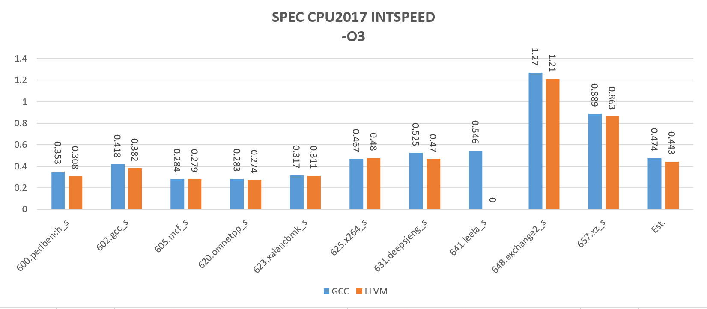
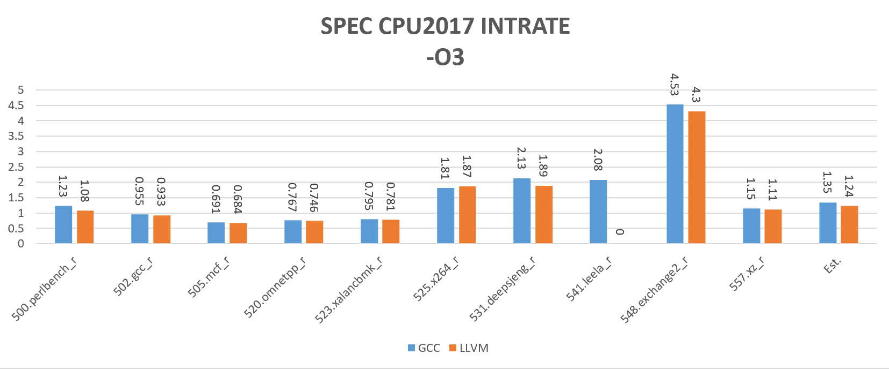
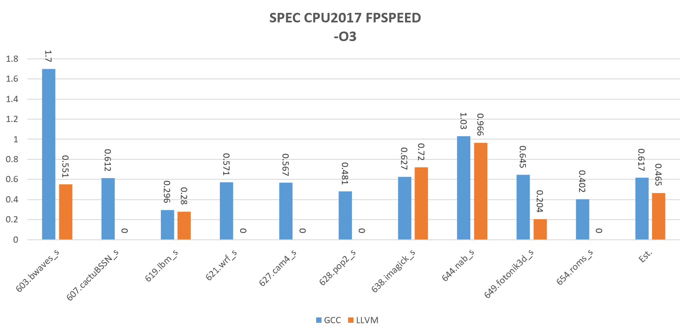
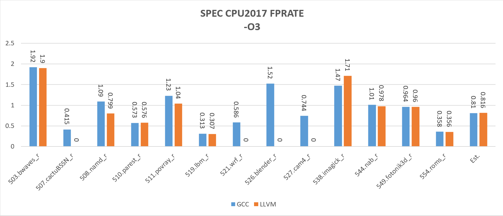

## 对比Unmatched上GCC和LLVM的SPEC CPU2017的性能差异

本次测试对比了GCC和LLVM在Unmatched上的SPEC CPU2017的性能差异。GCC版本是11.1.0，Clang版本是15.0.0。

### 源码版本

均是从源码编译，具体的分支和commit ID如下。

riscv-gcc: branch riscv-gcc-11.1.0, commit 5964b5c

llvm-project：branch main, commit 7fd60ee6e0a87957a718297a4a42d9881fc561e3l

### 测试命令

SPEC CPU 运行的命令：

```
runcpu -c CONFIG_FILE --noreportable -n 1 -I -T base intspeed
```

```
runcpu -c CONFIG_FILE --noreportable -n 1 -I -T base intrate
```

```
runcpu -c CONFIG_FILE --noreportable -n 1 -I -T base fpspeed
```

```
runcpu -c CONFIG_FILE --noreportable -n 1 -I -T base fprate
```

### 结果对比









从测试结果来看，在Unmatched上，在INT测试中，GCC在多数项目上略胜过LLVM，只有x264子项LLVM略胜过GCC。另外leela子项LLVM没有正常运行。

在FP测试中，LLVM有多个Fortran程序不能正常运行（507,521,526,527,607,621,627,628,654）。在FPSPEED性能上，603和645子项上GCC要明显优于LLVM。在FP性能上，LLVM优于GCC的子项是638和538。
