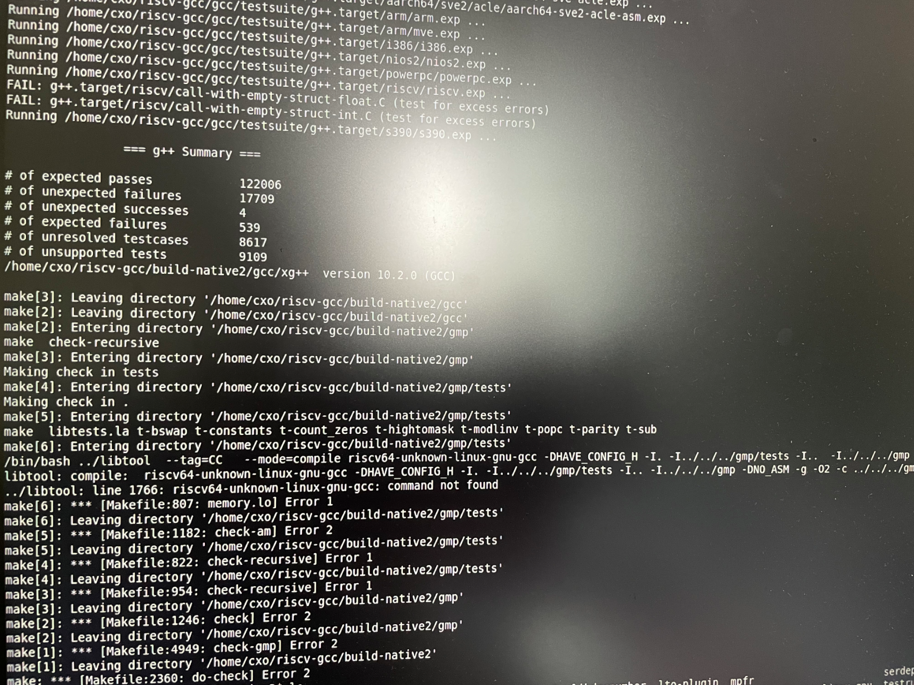

# 构建RISCV native GCC，并在D1上进行回归测试

## 任务描述

为了验证编译器的正确性，我们需要在RISCV开发板上来跑GCC的回归测试。因为我们遇到过RISCV binary在模拟器上运行和在实际硬件上运行效果不一致的情况，因此进一步做在开发板上的make check是有意义的。

编译工具链的构建一般可分为三种情况：

1. 本地构建本地编译工具链

例如在x86/linux64平台上构建x86的编译工具链。无论是工具链，还是测试用例，都是运行在本地上的，在运行make check的时候无需模拟器。

2. 本地构建交叉编译器

例如在x86/linux64平台上构建RISCV的交叉工具链，工具链运行的平台是x86，而工具链的target是RISCV平台。这种情况工具链运行在本地，可执行的测试用例是运行在target机器上的，那么运行make check就需要用到模拟器。

3. 交叉编译目标平台的编译器

例如在x86/linux64上交叉编译RISCV平台上运行的编译器。这种情况工具链和可执行的测试用例都是运行在target机器上的，需要模拟器来运行make check过程，也可以直接在RISCV开发板上运行make check。

我们现在就尝试跑通第三种情况。我在这里用的RISCV开发板是全志哪吒开发板（D1），操作系统是Debian。

## 知识补充

首先你要了解一下，三个名词："build, haost, target"，和三元组。

build：构建 gcc 编译器的平台系统环境，编译该软件使用的平台。

host:：是执行 gcc 编译器的平台系统环境，该软件运行的平台。

target：是让 gcc 编译器产生能在什么格式运行的平台的系统环境，该软件处理的目标平台。

三元组：架构-设备厂家-位

## 步骤

### 1. 在x86/Linux64上交叉编译RISCV native GCC

以下步骤是在x86/Linux64上进行的，交叉编译一个RISCV native GCC。

在交叉编译之前，你的x86/Linux64机器上应该有RISCV的交叉工具链（如果没有，请先构建riscv-gnu-toolchain）。

注意x86上用于交叉编译的工具链glic版本要和D1开发板上的glibc版本一致。

这里的步骤目前适用于编译riscv-gcc项目，整个riscv-gnu-toolchain项目还没有尝试。

0. 安装依赖软件：

```shell
sudo apt-get install autoconf automake autotools-dev curl python3 libmpc-dev libmpfr-dev libgmp-dev gawk build-essential bison flex texinfo gperf libtool patchutils bc zlib1g-dev libexpat-dev
```

1. 需要将你已经有的RISCV交叉工具链添加到PATH中。

注意工具链中的glibc要和D1开发板上的glibc版本一致，或者低于开发板的版本。
（我的D1上glibc版本是2.31，交叉工具链中的glibc版本是2.29）

```shell
export PATH="$HOME/temp/riscv/bin:$PATH"
```

2. 安装gmp,mpfr,mpc

不执行这一步，可能会报错:
```shell
configure: error: Building GCC requires GMP 4.2+, MPFR 3.1.0+ and MPC 0.8.0+.
```

需要执行下面的安装命令：
```shell
$ cd riscv-gnu-toolchain/riscv-gcc
$ contrib/download_prerequisites
```

3. 在riscv-gnu-toolchain/riscv-gcc下新建build目录，再进行configure/make/make install。

*整个riscv-gnu-toolchain不知道目前是否支持native的编译。*

```shell
$ cd riscv-gnu-toolchain/riscv-gcc

$ mkdir build-native && cd build-native

$ ../configure --with-host=riscv64-unknown-linux-gnu --target=riscv64-unknown-linux-gnu --host=riscv64-unknown-linux-gnu --enable-languages=c,c++ --enable-tls --enable-shared --prefix=$HOME/RISCV64/native

$ make -j $nproc

$ make install
```

编译中可能遇到找不到riscv64-unknown-linux-gnu-cc的问题：
```shell
riscv-gnu-toolchain/riscv-gcc/libgcc/configure: line 2739: riscv64-unknown-linux-gnu-cc: command not found
```
解决的办法是在你的RISCV交叉工具链的安装目录下新建一个cc的软链接指向gcc：
```shell
$ cd $HOME/opt/rv64_linux/bin

$ ln -snf $HOME/opt/rv64_linux/bin/riscv64-unknown-linux-gnu-gcc $HOME/opt/rv64_linux/bin/riscv64-unknown-linux-gnu-cc
```

4. 最后将编译好的RISCV native GCC拷贝到D1，验证是否可以运行

编译安装完成之后，把$HOME/RISCV64/native打包拷贝到D1上，在native/bin目录下执行`./gcc -v`，看到gcc的版本，则gcc可以运行。

然后再试着用gcc进行编译，编译一个fibo.c文件。

fibo.c 如下：
```shell
#include <stdio.h>

int main(){
       int i, n, t1 = 0, t2 = 1, nextTerm;

       printf("How many terms to output: ");
       scanf("%d", &n);

       printf("Fibonacci sequence: ");

       for(i = 1; i<=n; ++i){
               printf("%d, ", t1);
               nextTerm = t1 + t2;
               t1 = t2;
               t2 = nextTerm;
       }

       printf("\n");

       return 0;
}
```

编译发生错误：
```shell
$ gcc fibo.c -o fibo.out
In file included from fibo.c:1
/usr/include/stdio.h:10 fatal error: bits/libc-header-start.h: No such file or directory
   27 | #include <bits/libc-header-start.h>
```

解决办法是：把x86/Linux64上RISCV交叉工具链里面的sysroot（和bin在同一级目录）拷到D1上，编译的时候指定sysroot，编译成功：

```shell
$ gcc --sysroot=/home/cxo/RISCV64/native/sysroot fibo.c -o fibo.out
$ ./fibo.out
How many terms to outputs: 5
Fibonacci sequence: 0, 1, 1, 2, 3,
```

### 2. 将在x86/Linux64上构建好的riscv-gcc目录拷到D1上，并执行make check

将在第一步中在x86/Linux64上构建好的整个riscv-gcc打包拷贝到D1上（包括riscv-gcc源码，和其中的build目录）。

在D1上解压之后，进入build目录，执行`make check`。可能遇到的问题有：

问题1：

```shell
could not execvp('/usr/bin/sed', ... ): No such file or directory
```

解决方法：

D1上其实已经安装了sed，在/bin目录下，那么我们创建一个软连接就可以：
```shell
sudo ln -s /bin/sed /usr/bin/sed
```

问题2：

```shell
/bin/bash: line 18: runtest: command not found
```

解决方法：

```shell
sudo apt install dejagnu
```

问题3：make check能够成功执行gcc/g++的回归测试，在执行gmp测试时报错，报错如下：



问题4：回归测试用有需要用到binutils工具链的，这里我没有编译，有下面的报错：（报错在build-native2/gcc/testsuite/gcc/gcc.log里查看）
```shell
/home/cxo/riscv-gcc/build-native2/gcc/testsuite/g++/../../as: 106: exec: /home/cxo/temp/riscv/bin/../lib/gcc/riscv64-unknown-linux-gnu/10.2.0/../../../../riscv64-unknown-linux-gnu/bin/as: not found
```

我这里是在/home/cxo/temp/riscv/riscv64-unknown-linux-gnu/bin/下创建了binutils工具的软连接，指向系统D1系统下的binutils工具（/usr/bin目录下）。

问题5：测试用例中可执行代码很多都编译不过，有类似如下的报错：

```shell
Executing on host: /home/cxo/riscv-gcc/build-native2/gcc/xgcc -B/home/cxo/riscv-gcc/build-native2/gcc/ /home/cxo/rr
iscv-gcc/gcc/testsuite/gcc.target/riscv/save-restore-1.c    -fno-diagnostics-show-caret -fno-diagnostics-show-linee
-numbers -fdiagnostics-color=never  -fdiagnostics-urls=never   -O2 -msave-restore -fomit-frame-pointer  -lm  -o .//
save-restore-1.exe    (timeout = 300)
spawn -ignore SIGHUP /home/cxo/riscv-gcc/build-native2/gcc/xgcc -B/home/cxo/riscv-gcc/build-native2/gcc/ /home/cxoo
/riscv-gcc/gcc/testsuite/gcc.target/riscv/save-restore-1.c -fno-diagnostics-show-caret -fno-diagnostics-show-line--
numbers -fdiagnostics-color=never -fdiagnostics-urls=never -O2 -msave-restore -fomit-frame-pointer -lm -o ./save-rr
estore-1.exe^M
In file included from /home/cxo/riscv-gcc/gcc/testsuite/gcc.target/riscv/save-restore-1.c:4:^M
/usr/include/stdlib.h:25:10: fatal error: bits/libc-header-start.h: No such file or directory^M
compilation terminated.^M
compiler exited with status 1
FAIL: gcc.target/riscv/save-restore-1.c (test for excess errors)
Excess errors:
/usr/include/stdlib.h:25:10: fatal error: bits/libc-header-start.h: No such file or directory
compilation terminated.

UNRESOLVED: gcc.target/riscv/save-restore-1.c compilation failed to produce executable
```

导致这个错误的原因是因为找不到bits/libc-header-start.h文件，解决方法是设置一下C_INCLUDE_PATH、LIBRARY_PATH、LD_LIBRARY_PATH：

```shell
$ export C_INCLUDE_PATH=/home/cxo/temp/riscv/sysroot/usr/include:$C_INCLUDE_PATH
$ export LIBRARY_PATH=/usr/lib/riscv64-linux-gnu/:$LIBRARY_PATH
$ export LD_LIBRARY_PATH=/usr/lib/riscv64-linux-gnu/:$LD_LIBRARY_PATH
```
( 注意LD_LIBRARY_PATH和LIBRARY_PATH之间的区别，前者是运行时链接库，后者是编译时加载库。)

然后再执行`make check-gcc`

回归测试的结果如下：

```shell
                === gcc Summary ===

# of expected passes            115590
# of unexpected failures        73
# of unexpected successes       4
# of expected failures          590
# of unresolved testcases       31
# of unsupported tests          2283
```

我们需要对于一下这个结果和在x86上的交叉编译回归测试的差异，下面是在x86上构建riscv交叉编译器，并且运行回归测试。

### 3. 在x86/Linux64上构建riscv-gcc交叉编译器，并执行回归测试

```shell
$ ../configure --target=riscv64-unknown-linux-gnu --enable-languages=c,c++ --enable-tls --enable-shared --prefix=$HOME/RISCV64/cross
$ make -j 52
```

报错如下：

```shell
./gthr-default.h:35:10: fatal error: pthread.h: No such file or directory
```

构建GCC之前，需要有编译好的binutils和C库。如果没有在与GCC相同的源树中构建C库，那么还应该在配置GCC之前提供目标target库和头文件，使用--with-sysroot（或--with-headers和--with-libs指定目录。）

因此，重新configure和make：

```shell
$ ../configure --target=riscv64-unknown-linux-gnu --enable-languages=c,c++ --enable-tls --enable-shared --prefix=$HOME/RISCV64/cross --with-sysroot=/home/cxo/temp/riscv/sysroot

$ make -j 52
```

报下面的错：

```shell
/home/cxo/temp/riscv/sysroot/usr/include/gnu/stubs.h:8:11: fatal error: gnu/stubs-ilp32.h: No such file or directory
    8 | # include <gnu/stubs-ilp32.h>
      |           ^~~~~~~~~~~~~~~~~~~
compilation terminated.
```

应该是指定的sysroot中缺少32位兼容库，那就暂且使用`--disable-multilib`来编译：

```shell
$ ../configure --target=riscv64-unknown-linux-gnu --enable-languages=c,c++ --enable-tls --enable-shared --prefix=$HOME/RISCV64/cross --with-sysroot=/home/cxo/temp/riscv/sysroot  --disable-multilib

$ make -j 52
```
构建成功，然后再执行`make check`:

** 注意，如果提示没有runtest工具，可以需要安装dejagnu: `sudo apt install dejagnu`.

回归测试的结果：

```shell
        === gcc Summary ===

# of expected passes        92671
# of unexpected failures    18672
# of unexpected successes   4
# of expected failures      590
# of unresolved testcases   8
# of unsupported tests      2449
```
（gcc测试用例共有114394）


```shell
                === g++ Summary ===

# of expected passes            168886
# of unexpected failures        9259
# of expected failures          682
# of unresolved testcases       28
# of unsupported tests          8478
```
（g++测试用例共有187333个）


### 3. 结论

对比在D1和x86上gcc回归测试的结果，看到在D1上有更多的expected passes。D1上unresolved testcases要多一些，其他项目基本相仿。

（D1上g++的回测结果还有些问题，待补充）
