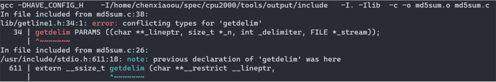
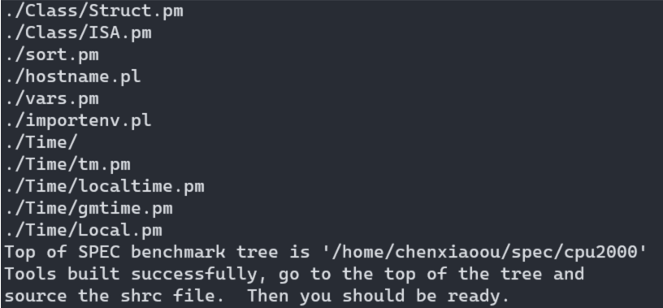

# How to install and run SPEC CPU2000 on Hifive unmatched

##  Build toolset

About how to build toolset we can refer SPEC website:

https://www.spec.org/cpu2000/docs/tools_build.txt

While building toolset, we encountered these issues as following.

#### 1. replace config.guess and config.sub for the tools bellow

We need replace config files for specinvoke, make-3.80, tar-1.15.1, and the config file paths are as follow:
```
./specinvoke/config.guess
./make-3.80/config/config.guess
./tar-1.15.1/config/config.guess
```
(config.guess and config.sub are under the same directory)


#### 2. undefined reference to `__alloca'

error information:

```
glob.c:(.text+0x126e): undefined reference to `__alloca'
/usr/bin/ld: glob.c:(.text+0x13dc): undefined reference to `__alloca'
/usr/bin/ld: glob.c:(.text+0x147c): undefined reference to `__alloca'
collect2: error: ld returned 1 exit status
```

solution:

modify make-3.80/glob/glob.c line 209：
```
#if !defined __alloca && defined __GNU_LIBRARY__
```

#### 3. undefined reference to `__stat'

error information:

```
linking make...
/usr/bin/ld: glob.o: in function `.L57':
glob.c:(.text+0x7d8): undefined reference to `__stat'
/usr/bin/ld: glob.o: in function `.L82':
glob.c:(.text+0xb2a): undefined reference to `__stat'
/usr/bin/ld: glob.o: in function `.L71':
glob.c:(.text+0xd5e): undefined reference to `__stat'
/usr/bin/ld: glob.o: in function `.L134':
glob.c:(.text+0x1274): undefined reference to `__stat'
collect2: error: ld returned 1 exit status
```

solution

modify make-3.80/glob/glob.c：
```
# if _GNU_GLOB_INTERFACE_VERSION == GLOB_INTERFACE_VERSION 
```
to
```
# if _GNU_GLOB_INTERFACE_VERSION >= GLOB_INTERFACE_VERSION
```

#### 4. format incompatible

error information: 

```
md5sum.c: In function 'main':
md5sum.c:682:15: warning: format '%X' expects argument of type 'unsigned int', but argument 2 has type 'size_t' {aka 'long unsigned int'} [-Wformat=]
  682 |   printf ("%08X", size);
      |            ~~~^   ~~~~
      |               |   |
      |               |   size_t {aka long unsigned int}
      |               unsigned int
      |            %08lX
make: *** [md5sum.o] Error 1
```

solution:

modify specmd5sum/md5sum.c：
```
printf ("%08X", size);
```
to
```
printf ("%08lX", size);
```

#### 5. error: conflicting types for 'getline'

error information

```
sed -i "s/getline/getline1/g" `grep getline -rl $HOME/spec/cpu2000/tools/src/specmd5sum`
```

#### 6. fatal error: getline1.h: No such file or directory

After modifying specmd5sum，this error comes up.

```
gcc -DHAVE_CONFIG_H    -I/home/xxx/spec/cpu2000/tools/output/include   -I. -Ilib  -c -o md5sum.o md5sum.c
md5sum.c:38:10: fatal error: getline1.h: No such file or directory
   38 | #include "getline1.h"
      |          ^~~~~~~~~~~~
compilation terminated.
make: *** [md5sum.o] Error 1
```

solution:

rename lib/getline.h lib/getline.c to lib/getline1.h and lib/getline1.c

#### 7. error: conflicting types for 'getdelim'




#### 8. make: *** No rule to make target <command-line>', needed byminiperlmain.o’. Stop

Can't fix this error, the walk-around is to replace perl-5.8.7 with perl-5.12.3 in SPEC CPU2006 toolset.

In addition, need to  comment this line in buildtools script.
```
# [ -f $i/spec_do_no_tests ] || ($MYMAKE test; testordie "error running $i test suite")
```

Then running buildtools will be OK：



## Packagetools and install

After building toolset successfully，then we need to package the toolset and install SPEC CPU 2000. The commands are as following:
```
$ cd $SPEC
$ source shrc
$ packagetools linux-riscv64
$ export SPEC_INSTALL_NOCHECK=1
$ ./install.sh -u linux-riscv64
```

## Running CPU2000

INT RATE
```
runspec --config linux-riscv64.cfg -n 1 --noreportable --rate --users 4 int
```
INT SPEED
```
runspec --config linux-riscv64.cfg -n 1 --noreportable int
```
FP RATE
```
runspec --config linux-riscv64.cfg -n 1 --noreportable --rate --users 4 fp
```
FP SPEED
```
runspec --config linux-riscv64.cfg -n 1 --noreportable fp
```

## Running CPU2000
  
The config file we use is as bellow.
  
```
###############################################################################
# This is a sample config file for x86 linux using GCC 3.3.x compiler.
# This does not provide any peak level tuning, but has the portability
# flags and can be used as a starter config file. This config file
# does not use any Fortran 90 compiler,
# so the F90 benchmarks in SPECfp suite cannot be compiled with this.
# The F90 benchmarks are: 178.galgel, 187.facerec, 189.lucas, 191.fma3d
# Although this config file has only been tested with gcc 3.3.3 on SuSE Linux
# 9.2, it will probably also work with other versions of the gcc (x86)
# compiler.
###############################################################################
# To run:
#     runspec -c linux-x86-gcc.cfg -T all -n 3 int fp
# The extension 'gcc33-high-opt' uses high optimization and is enabled by
# default.  If you want lower levels of optimization, use the extension
# 'gcc33-low-opt', e.g.
#     runspec -c linux-x86-gcc.cfg -T all -n 3 -e gcc33-low-opt int fp
###############################################################################


# Modify these variables according to your system, vendor, run environment etc.
company_name    = XYZ Inc.
hw_model        = ASUS SK8V, Opteron (TM) 150
hw_cpu          = AMD Opteron (TM) 150
hw_cpu_mhz      = 2400
hw_disk         = IDE, WD2000
hw_fpu          = Integrated
hw_memory       = 2 x 512 PC3200 DDR SDRAM CL2.0
hw_avail        = May-2003
test_date       =
sw_file         = Linux/ext3
sw_os           = SuSE Linux 9.2 for x86
hw_vendor       =
tester_name     = XYZ Inc.
license_num     = 9999
hw_ncpu         = 1
hw_ncpuorder    = 1
hw_ocache       = N/A
hw_other        = None
hw_parallel     = No
hw_pcache       = 64KBI + 64KBD on chip
hw_scache       = 1024KB(I+D) on chip
hw_tcache       = N/A
sw_state        = Multi-user SuSE Run level 3

VENDOR          =
action          = validate
tune            = base
output_format   = asc,html,config
ext             = gcc10-low-opt

check_md5       = 1
reportable      = 1

teeout=yes
teerunout=yes

#
# NOTE: The F90 benchmarks will *not* work with this compiler
#       setting.
default=default=default=default:
CC      = gcc
CXX     = g++
FC      = gfortran --std=legacy

################################################################
# Portability Flags
################################################################

178.galgel=default=default=default:
EXTRA_FFLAGS = -ffixed-form -FI

186.crafty=default=default=default:
#CPORTABILITY   = -DLONG_HAS_64BITS -DLINUX
CPORTABILITY =   -DLINUX_i386 -DSPEC_CPU2000_LP64 -DLONG_HAS_64BITS -UHAS_LONGLONG

252.eon=default=default=default:
CXXPORTABILITY  = -DHAS_ERRLIST -fpermissive -DUSE_STRERROR

253.perlbmk=default=default=default:
CPORTABILITY    = -DSPEC_CPU2000_NEED_BOOL -std=gnu89 -DI_FCNTL -DSPEC_CPU2000_GLIBC22 -DSPEC_CPU2000_DUNIX

254.gap=default=default=default:
#CPORTABILITY   = -DSYS_HAS_SIGNAL_PROTO -DSYS_HAS_MALLOC_PROTO -DSYS_HAS_CALLOC_PROTO -DSYS_IS_USG -DSYS_HAS_IOCTL_PROTO -DSYS_HAS_TIME_PROTO -D_GNU_SOURCE
CPORTABILITY = -DSPEC_CPU2000 -DSPEC_CPU2000_LP64 -DSYS_HAS_CALLOC_PROTO -DSYS_IS_USG -DSYS_HAS_IOCTL_PROTO -DSYS_HAS_TIME_PROTO -DSYS_HAS_SIGNAL_PROTO -DSYS_HAS_CALLOC_PROTO -DHOST_LINUX -fwrapv

255.vortex=default=default=default:
CPORTABILITY = -DSPEC_CPU2000_LP64

300.twolf=default=default=default:
CPORTABILITY = -DSPEC_CPU2000_LP64 -DHAVE_SIGNED_CHAR

################################################################
# Baseline Tuning Flags
################################################################

#
# int2000
# Base tuning default optimization
#
int=base=gcc10-low-opt=default:
notes0080=  Baseline C:   gcc -O2
COPTIMIZE       = -O2
notes0085=  Baseline C++: g++ -O2
CXXOPTIMIZE     = -O2
feedback=0

int=base=gcc10-high-opt=default:
notes0080=  Baseline C:   gcc -O3 -funroll-all-loops
COPTIMIZE       = -O3 -funroll-all-loops
notes0085=  Baseline C++: g++ -O3 -funroll-all-loops
CXXOPTIMIZE     = -O3 -funroll-all-loops

int=peak=default=default:
basepeak=yes

fp=base=gcc10-low-opt=default:
notes0080=  Baseline C,Fortran: -O2
COPTIMIZE       = -O2
FOPTIMIZE       = -O2

fp=base=gcc10-high-opt=default:
notes0080=  Baseline C,Fortran: -O3 -funroll-all-loops
COPTIMIZE       = -O3 -funroll-all-loops
FOPTIMIZE       = -O3 -funroll-all-loops

fp=peak=default=default:
basepeak=yes

default=default=default=default:
notes0030=  Portability:
notes0086=  Peak tuning: basepeak=yes for all peak runs.
# change these variables according to your SUT
sw_avail= Dec-2003
sw_compiler0000= gcc and g77 3.3.x compiler
```
