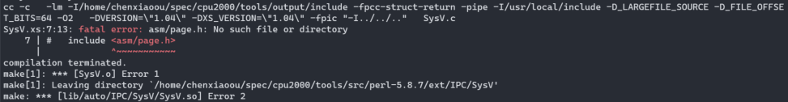
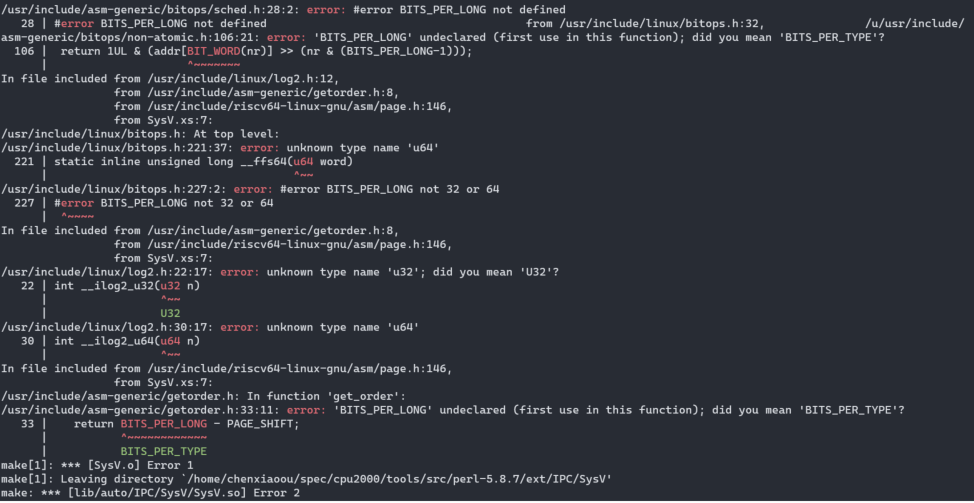

# How to install and run SPEC CPU2000 on Hifive unmatched

##  Build toolset

About how to build toolset we can refer SPEC website:

https://www.spec.org/cpu2000/docs/tools_build.txt

While building toolset, we encountered these issues as following.

#### 1. replace config.guess and config.sub for the tools bellow

We need replace config files for specinvoke, make-3.80, tar-1.15.1, and the config file paths are as follow:
```
./specinvoke/config.guess
./make-3.80/config/config.guess
./tar-1.15.1/config/config.guess
```
(config.guess and config.sub are under the same directory)


#### 2. undefined reference to `__alloca'

报错信息：

```
glob.c:(.text+0x126e): undefined reference to `__alloca'
/usr/bin/ld: glob.c:(.text+0x13dc): undefined reference to `__alloca'
/usr/bin/ld: glob.c:(.text+0x147c): undefined reference to `__alloca'
collect2: error: ld returned 1 exit status
```

解决方法：

make-3.80/glob/glob.c的209行改为：
```
#if !defined __alloca && defined __GNU_LIBRARY__
```

#### 3. undefined reference to `__stat'

报错信息：

```
linking make...
/usr/bin/ld: glob.o: in function `.L57':
glob.c:(.text+0x7d8): undefined reference to `__stat'
/usr/bin/ld: glob.o: in function `.L82':
glob.c:(.text+0xb2a): undefined reference to `__stat'
/usr/bin/ld: glob.o: in function `.L71':
glob.c:(.text+0xd5e): undefined reference to `__stat'
/usr/bin/ld: glob.o: in function `.L134':
glob.c:(.text+0x1274): undefined reference to `__stat'
collect2: error: ld returned 1 exit status
```

解决方法：

修改make-3.80/glob/glob.c：
```
# if _GNU_GLOB_INTERFACE_VERSION == GLOB_INTERFACE_VERSION 
```
to
```
# if _GNU_GLOB_INTERFACE_VERSION >= GLOB_INTERFACE_VERSION
```

#### 4. format不兼容

报错信息：

```
md5sum.c: In function 'main':
md5sum.c:682:15: warning: format '%X' expects argument of type 'unsigned int', but argument 2 has type 'size_t' {aka 'long unsigned int'} [-Wformat=]
  682 |   printf ("%08X", size);
      |            ~~~^   ~~~~
      |               |   |
      |               |   size_t {aka long unsigned int}
      |               unsigned int
      |            %08lX
make: *** [md5sum.o] Error 1
```

解决方法：

修改specmd5sum/md5sum.c：
```
printf ("%08X", size);
```
to
```
printf ("%08lX", size);
```

#### 5. error: conflicting types for 'getline'

解决方法：

```
sed -i "s/getline/getline1/g" `grep getline -rl $HOME/spec/cpu2000/tools/src/specmd5sum`
```

#### 6. fatal error: getline1.h: No such file or directory

上面改了specmd5sum的源码，然后出现了这个错误。

```
gcc -DHAVE_CONFIG_H    -I/home/xxx/spec/cpu2000/tools/output/include   -I. -Ilib  -c -o md5sum.o md5sum.c
md5sum.c:38:10: fatal error: getline1.h: No such file or directory
   38 | #include "getline1.h"
      |          ^~~~~~~~~~~~
compilation terminated.
make: *** [md5sum.o] Error 1
```

重命名lib/getline.h lib/getline.c

#### 7. error: conflicting types for 'getdelim'


#### 8. make: *** No rule to make target <command-line>', needed byminiperlmain.o’. Stop

perl编译中出现上面的报错，解决方法是将perl-5.8.7/makefile和perl-5.8.7/x2p/makefile中包含<command-line>的行删除掉。

然后不要直接执行buildtools，这样又会重新配置，重新生成makefile，而是手动在perl-5.8.7目录下执行：
```
/home/xxx/spec/cpu2000/tools/output/bin/make
```

然后，又出现了如下错误：


我尝试采用软链接fake的方式，参考https://bugs.gentoo.org/168312的comment4，需要大量的fake，并且还引发了下面的问题：



暂时解决不了这个问题。

目前的办法是将CPU2006的perl-5.12.3的源码拿来代perl-5.8.7，另外还需要注释掉buildtools中的下面一行：
```
# [ -f $i/spec_do_no_tests ] || ($MYMAKE test; testordie "error running $i test suite")
```
然后再执行buildtools就可以成功了：


## Pakagetools and install

```
$ cd $SPEC
$ source shrc
$ packagetools linux-riscv64
$ export SPEC_INSTALL_NOCHECK=1
$ ./install.sh -u linux-riscv64
```


## Running CPU2000

#### Round 1

```
runspec --config linux-riscv64.cfg -n 1 -I --noreportable int
```

```
                                   Estimated                     Estimated
                   Base      Base      Base      Peak      Peak      Peak
   Benchmarks    Ref Time  Run Time   Ratio    Ref Time  Run Time   Ratio
   ------------  --------  --------  --------  --------  --------  --------
   164.gzip          1400   584       240    *
   175.vpr           1400   531       264    *
   176.gcc           1100   295       373    *
   181.mcf           1800   775       232    *
   186.crafty        1000        --          X
   197.parser        1800   789       228    *
   252.eon           1300        --          X
   253.perlbmk       1800        --          X
   254.gap           1100     4.19           X
   255.vortex        1900        --          X
   256.bzip2         1500   522       288    *
   300.twolf         3000   673              X
   ========================================================================
   164.gzip          1400   584       240    *
   175.vpr           1400   531       264    *
   176.gcc           1100   295       373    *
   181.mcf           1800   775       232    *
   186.crafty                                X
   197.parser        1800   789       228    *
   252.eon                                   X
   253.perlbmk                               X
   254.gap                                   X
   255.vortex                                X
   256.bzip2         1500   522       288    *
   300.twolf                                 X
   Est. SPECint_base2000                   --
   Est. SPECint2000                                                      --
```
