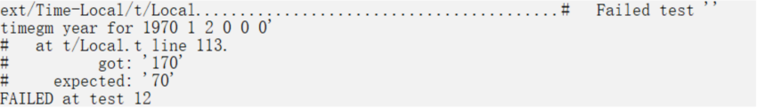
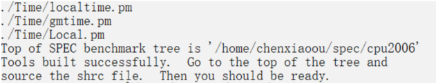
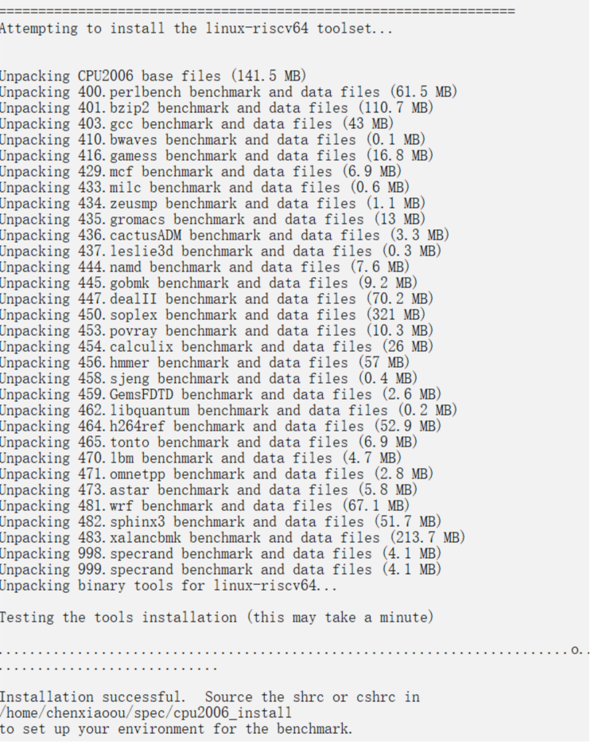

# How to install and run SPEC CPU2006 on Hifive Unmatched

Similar to SPEC CPU2017, CPU2006 don't support RISCV officially, so we need to build toolset by ourselves. Official document can be referenced:

[Building the SPEC CPU2006 Tool Suite](https://www.spec.org/cpu2006/Docs/tools-build.html)

The RISCV platform we use is described as bellow:

- Board: Hifive Unmatched
- Memory: 16G
- Storage: 1T SSD
- OS: Ubuntu21.04
- GCC：10.3.0
- Glibc：2.33

### Error when building toolset and solutions 

#### more undefined references to __alloca' follow

solution:

modify src/make-3.82/glob/glob.c line 211:

```
- #if !defined __alloca && !defined __GNU_LIBRARY__
+ #if !defined __alloca && defined __GNU_LIBRARY__
```

#### `'gets' undeclared here` when building tar

cause:

Code compatibility issues due to dependency library version upgrades. 

solution：

modify these two files:

src/specsum/gnulib/stdio.in.h

src/tar-1.25/gnu/stdio.in.h

```
--- stdio.in.h.old      2021-10-18 04:23:40.643989910 -0400
+++ stdio.in.h  2021-10-18 04:31:03.193990991 -0400
@@ -159,7 +159,9 @@ _GL_WARN_ON_USE (fflush, "fflush is not
    so any use of gets warrants an unconditional warning.  Assume it is
    always declared, since it is required by C89.  */
 #undef gets
-_GL_WARN_ON_USE (gets, "gets is a security hole - use fgets instead");
+#if defined(__GLIBC__) && !defined(__UCLIBC__) && !__GLIBC_PREREQ(2, 16)
+ _GL_WARN_ON_USE (gets, "gets is a security hole - use fgets instead");
+#endif

 #if @GNULIB_FOPEN@
 # if @REPLACE_FOPEN@
```

#### undefined reference to `pow` etc.

export PERLFLAGS="-A libs=-lm -A libs=-ldl -A libs=-lc -A ldflags=-lm -A cflags=-lm -A ccflags=-lm"

#### perl Configure need patch

```
--- /mnt/tools/src/perl-5.12.3/Configure        2011-03-03 17:29:36.000000000 -00
500
+++ perl-5.12.3/Configure       2021-11-03 02:39:12.004657891 -0400
@@ -4536,7 +4536,7 @@ else
 fi
 $rm -f try try.*
 case "$gccversion" in
-1*) cpp=`./loc gcc-cpp $cpp $pth` ;;
+1.*) cpp=`./loc gcc-cpp $cpp $pth` ;;
 esac
 case "$gccversion" in
 '') gccosandvers='' ;;
@@ -4688,6 +4688,18 @@ fi

 if $ok; then
        : nothing
+elif echo 'Maybe "'"$cc"' -E -ftrack-macro-expansion=0" will work...'; \
+       $cc -E -ftrack-macro-expansion=0 <testcpp.c >testcpp.out 2>&1; \
+       $contains 'abc.*xyz' testcpp.out >/dev/null 2>&1 ; then
+       echo "Yup, it does."
+       x_cpp="$cc $cppflags -E -ftrack-macro-expansion=0"
+       x_minus='';
+elif echo 'Maybe "'"$cc"' -E -ftrack-macro-expansion=0 -" will work...';
+       $cc -E -ftrack-macro-expansion=0 - <testcpp.c >testcpp.out 2>&1; \
+       $contains 'abc.*xyz' testcpp.out >/dev/null 2>&1 ; then
+       echo "Yup, it does."
+       x_cpp="$cc $cppflags -E -ftrack-macro-expansion=0"
+       x_minus='-';
 elif echo 'Maybe "'"$cc"' -E" will work...'; \
        $cc -E <testcpp.c >testcpp.out 2>&1; \
        $contains 'abc.*xyz' testcpp.out >/dev/null 2>&1 ; then
@@ -5128,7 +5140,7 @@ fi
 case "$hint" in
 default|recommended)
        case "$gccversion" in
-       1*) dflt="$dflt -fpcc-struct-return" ;;
+       1.*) dflt="$dflt -fpcc-struct-return" ;;
        esac
        case "$optimize:$DEBUGGING" in
        *-g*:old) dflt="$dflt -DDEBUGGING";;
@@ -5143,7 +5155,7 @@ default|recommended)
                ;;
        esac
        case "$gccversion" in
-       1*) ;;
+       1.*) ;;
        2.[0-8]*) ;;
        ?*)     set strict-aliasing -fno-strict-aliasing
                eval $checkccflag
@@ -5245,7 +5257,7 @@ case "$cppflags" in
 *)  cppflags="$cppflags $ccflags" ;;
 esac
 case "$gccversion" in
-1*) cppflags="$cppflags -D__GNUC__"
+1.*) cppflags="$cppflags -D__GNUC__"
 esac
 case "$mips_type" in
 '');;
```

refer to：https://github.com/Perl/perl5/issues/14491


### packagetools linux-riscv64

After building toolset successfully, next we need to package the toolset.

first, make directory $SPEC/tools/bin/linux-riscv64, and create a file named description.

then back to path $SPEC and execute:

```
$  ./bin/packagetools linux-riscv64
```

### Installation of CPU2006

Installation of SPEC CPU 2006 will fail because several perl tests can't pass. The walkaround is set  `export SPEC_INSTALL_NOCHECK=1 ` before installation to skip perl verification.

Here we also record some issues and their solutions.

- Perl test case numconvert.t failure

solution: add compiler option `-A ccflags=-fwrapv`
```
$ export PERLFLAGS="-A ccflags=-fwrapv"
```

- Perl test case Local.t Failure

Local.t may has this error, the solution is to modify perl-5.12.3/ext/Time-Local/t/Local.t as the patch bellow.



```shell
--- /mnt/tools/src/perl-5.12.3/ext/Time-Local/t/Local.t 2011-03-03 17:29:36.00000
00000 -0500
+++ perl-5.12.3/ext/Time-Local/t/Local.t        2021-10-28 05:19:07.500262285 -00
400
@@ -84,7 +84,7 @@ for (@time, @neg_time) {

     # Test timelocal()
     {
-        my $year_in = $year < 70 ? $year + 1900 : $year;
+       my $year_in = $year + 1900;
         my $time = timelocal($sec,$min,$hour,$mday,$mon,$year_in);

         my($s,$m,$h,$D,$M,$Y) = localtime($time);
@@ -100,8 +100,8 @@ for (@time, @neg_time) {

     # Test timegm()
     {
-        my $year_in = $year < 70 ? $year + 1900 : $year;
-        my $time = timegm($sec,$min,$hour,$mday,$mon,$year_in);
+        my $year_in = $year + 1900;
+       my $time = timegm($sec,$min,$hour,$mday,$mon,$year_in);

         my($s,$m,$h,$D,$M,$Y) = gmtime($time);

@@ -117,7 +117,6 @@ for (@time, @neg_time) {

 for (@bad_time) {
     my($year, $mon, $mday, $hour, $min, $sec) = @$_;
-    $year -= 1900;
     $mon--;

     eval { timegm($sec,$min,$hour,$mday,$mon,$year) };
@@ -126,14 +125,14 @@ for (@bad_time) {
 }

 {
-    is(timelocal(0,0,1,1,0,90) - timelocal(0,0,0,1,0,90), 3600,
+    is(timelocal(0,0,1,1,0,1990) - timelocal(0,0,0,1,0,1990), 3600,
        'one hour difference between two calls to timelocal');

-    is(timelocal(1,2,3,1,0,100) - timelocal(1,2,3,31,11,99), 24 * 3600,
+    is(timelocal(1,2,3,1,0,2000) - timelocal(1,2,3,31,11,1999), 24 * 3600,
        'one day difference between two calls to timelocal');

     # Diff beween Jan 1, 1980 and Mar 1, 1980 = (31 + 29 = 60 days)
-    is(timegm(0,0,0, 1, 2, 80) - timegm(0,0,0, 1, 0, 80), 60 * 24 * 3600,
+    is(timegm(0,0,0, 1, 2, 1980) - timegm(0,0,0, 1, 0, 1980), 60 * 24 * 3600,
        '60 day difference between two calls to timegm');
 }
```

#### Perl test case DynaLoader.t failure

solution:

```
export PERLFLAGS="$PERLFLAGS -Dlibpth=/usr/lib/riscv64-linux-gnu"
```

#### Skip verification

As mentioned ahead, perl test can be skiiped by setting SPEC_INSTALL_NOCHECK.
```
export SPEC_INSTALL_NOCHECK=1 
```

Now we can execute install.sh successfully.

### Conclusion about build and install CPU2006

First set PERLFLAGS, then execute buildtools.

```
$ export PERLFLAGS="-A libs=-lm -A libs=-lc -A ldflags=-lm -A cflags=-lm -A ccflags=-lm -A ccflags=-fwrapv -Dlibpth=/usr/lib/riscv64-linux-gnu -A libs=-ldl"
$ cd $SPEC/tools/src
$ ./buildtools
```

Building succeed with this information:



Then make directory tools/bin/linux-riscv64 and create a file named description:

```shell
$ cd $SPEC/tools/bin/
$ mkdir linux-riscv64
```

description file contains：
```
For riscv64 Linux systems
                              Built on ubuntu21.04 with GCC 10.3.0
```

Then package the toolset.

```
$ cd $SPEC
$ source shrc
$ packagetools linux-riscv64
```

Finally install CPU2006：

```
$ export SPEC_INSTALL_NOCHECK=1 
$ ./install.sh -u linux-riscv64 -d /home/chenxiaoou/spec/cpu2006_install
```

Installation succeed with this information.



### Running CPU2006

INT RATE
```
runspec -c linux64-riscv64.cfg -n 1 -T base --noreportable --rate 4 int
```
INT SPEED
```
runspec -c linux64-riscv64.cfg -n 1 -T base --noreportable --speed int
```
FP RATE
```
runspec -c linux64-riscv64.cfg -n 1 -T base --noreportable --rate 4 fp
```
FP SPEED
```
runspec -c linux64-riscv64.cfg -n 1 -T base -I --noreportable --speed fp
```

### Config files

#### GCC config
```
# This is a sample config file for CPU2006. It was tested with:
#
#      Compiler name/version:       [gcc, g++, gfortran 4.3.4]
#                                   [gcc, g++, gfortran 4.4.4]
#                                   [gcc, g++, gfortran 4.6.0]
#      Operating system version:    [SLES 11 SP1, 64-bit, gcc 4.3.4 and 4.6.0]
#                                   [RHEL 6, 64-bit, gcc 4.4.4]
#      Hardware:                    [Opteron]
#
# If your platform uses different versions, different
# hardware or operates in a different mode (for
# example, 32- vs. 64-bit mode), there is the possibiliy
# that this configuration file may not work as-is.
#
# Note that issues with compilation should be directed
# to the compiler vendor. Information about SPEC techncial
# support can be found in the techsupport document in the
# Docs directory of your benchmark installation.
#
# Also note that this is a sample configuration. It
# is expected to work for the environment in which
# it was tested; it is not guaranteed that this is

# Note that you might find a more recent config file for
# your platform with the posted results at
# www.spec.org/cpu2006
####################################################################
# AMD64 (64-bit) gcc 4.3, 4.4 and 4.6 config file
# Sample Config file for CPU2006
#####################################################################

ignore_errors = yes
tune          = base
basepeak      = yes
# Select and/or modify as needed
ext           = gcc10-64bit
output_format = asc,csv,html
#flagsurl0     = $[top]/config/flags/Example-gcc4x-flags-revA.xml
#flagsurl1     = $[top]/config/flags/Example-linux-platform-revA.xml
reportable    = yes
teeout        = yes
teerunout     = yes
hw_avail      = Dec-9999
license_num   = 0
test_sponsor  = Test Sponsor (Optional, defaults to hw_vendor)
tester        = (Optional, defaults to hw_vendor)


%define GCCge10  # EDIT: remove the '#' from column 1 if using GCC 10 or later

default=default=default=default:
#####################################################################
#
# Compiler selection
#
#####################################################################
# NOTE: The path may be different if you use the compiler from
#       the gnu site.
CC                 = /usr/bin/gcc -march=rv64imafdc
CXX                = /usr/bin/g++ -march=rv64imafdc
FC                 = /usr/bin/gfortran -march=rv64imafdc

## HW config
# default sysinfo is expected to write hw_cpu_name, hw_memory, hw_nchips,
# hw_disk
hw_model           = System Model Name
hw_cpu_char        =
hw_cpu_mhz         = 9999
hw_fpu             = Integrated
hw_ncores          = number of cores enabled
hw_ncoresperchip   = number of cores manufactured into each chip
hw_nthreadspercore = number of threads enabled per core
hw_ncpuorder       = 1,2 chips
hw_pcache          = 9999 KB I + 9999 KB D on chip per core
hw_scache          = 9999 KB I+D on chip per core
hw_tcache          = 9999 MB I+D on chip per chip
hw_ocache          = None
hw_vendor          = System Vendor
hw_other           = None

## SW config
# default sysinfo is expected to write prepared_by, sw_os, sw_file, sw_state
# Descriptions of the different compilers tested
sw_compiler        = gcc, g++ & gfortran 10.3.0
# For SLES11 SP1
sw_avail           = May-2010
# For RHEL6
#sw_avail           = Oct-2010
# For gcc 4.6
#sw_avail           = Mar-2011
sw_other           = None
sw_base_ptrsize    = 64-bit
sw_peak_ptrsize    = 64-bit

#####################################################################
# Notes
#####################################################################

notes_os_000 ='ulimit -s unlimited' was used to set environment stack size

#####################################################################
# Optimization
#####################################################################

default=base=default=default:
COPTIMIZE   = -Ofast -fno-strict-aliasing -flto
CXXOPTIMIZE = -Ofast -fno-strict-aliasing -flto
FOPTIMIZE   = -Ofast -fno-strict-aliasing -flto

#####################################################################
# 32/64 bit Portability Flags - all
#####################################################################

default=base=default=default:
PORTABILITY    = -DSPEC_CPU_LP64

#####################################################################
# Portability Flags
#####################################################################

400.perlbench=default=default=default:
CPORTABILITY   = -DSPEC_CPU_LINUX_X64 -std=gnu89

447.dealII=default=default=default:
CXXPORTABILITY = -fpermissive

450.soplex=default=default=default:
CXXPORTABILITY = -std=c++03

462.libquantum=default=default=default:
CPORTABILITY   =  -DSPEC_CPU_LINUX

464.h264ref=default=default=default:
CPORTABILITY = -fsigned-char

483.xalancbmk=default=default=default:
CXXPORTABILITY = -DSPEC_CPU_LINUX

481.wrf=default=default=default:
CPORTABILITY   = -DSPEC_CPU_CASE_FLAG -DSPEC_CPU_LINUX

482.sphinx3=default=default=default:
CPORTABILITY = -fsigned-char

#----------------------------------------------------------------------
#       GCC workarounds that do not count as PORTABILITY
#----------------------------------------------------------------------

416.gamess=default=default=default:
% ifdef %{GCCge10}
        EXTRA_FFLAGS = -fallow-argument-mismatch
% endif
        EXTRA_FFLAGS += -std=legacy -funconstrained-commons

481.wrf=default=default=default:
% ifdef %{GCCge10}
        EXTRA_FFLAGS = -fallow-argument-mismatch
% endif
```

#### LLVM config
