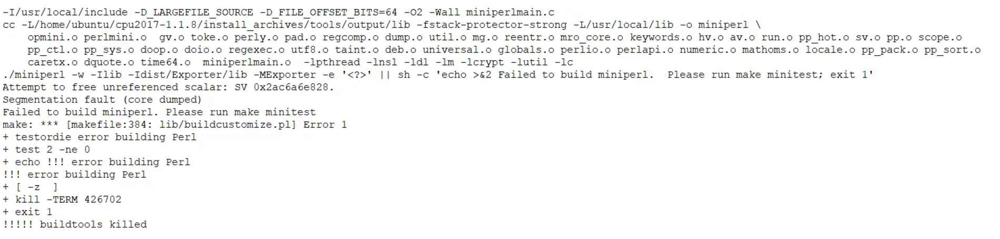
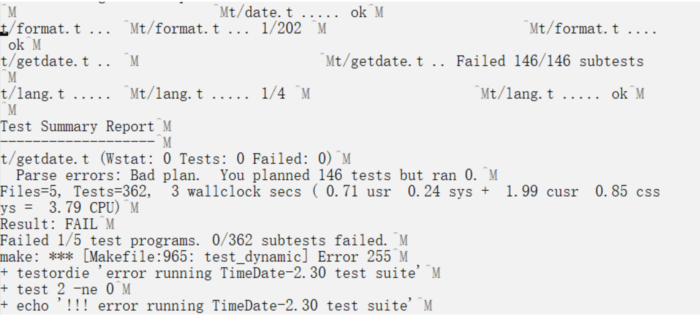
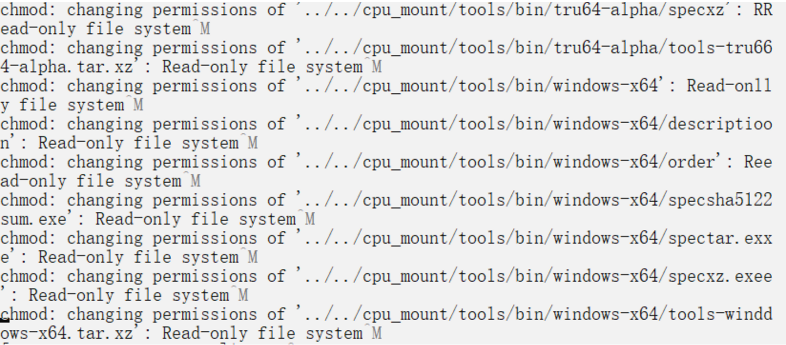
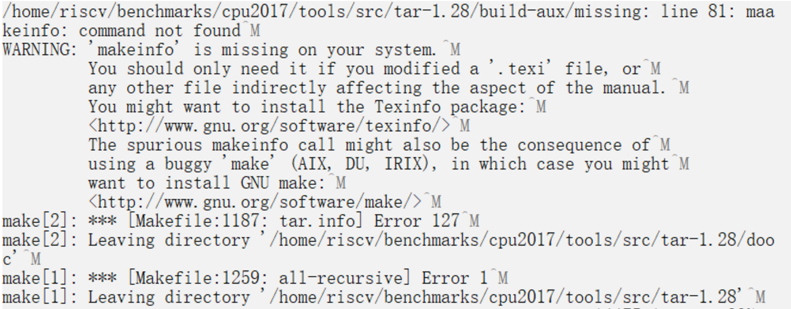
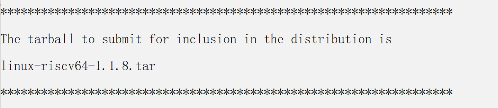
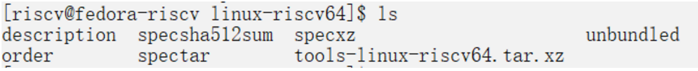
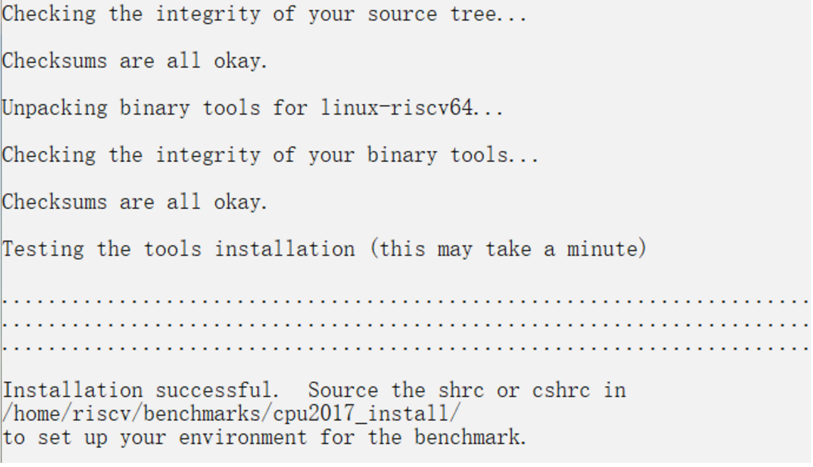

# How to install and run SPEC CPU2017 on Hifive unmatched

### CPU2017 system requirements 

  - 1 to 2 GB of main memory to run SPECrate (per copy); 16 GB for SPECspeed.
  - 250 GB disk space is recommended; a minimal installation needs 10 GB.
  - C, C++, and Fortran compilers (or a set of pre-compiled binaries from another CPU 2017 user).
  A variety of chips and operating systems are supported.

## Building toolset

SPEC CPU running process need some tools, like spectar,specperl etc. These tools are just wrappers for open sources tools. SPEC doesn't support RISCV officially, so we need to build this tool set by hand. There is an officail help document can be referred.

https://www.spec.org/cpu2017/Docs/tools-build.html

The issues that we met are listed in the following.

### Issues when building toolset for RISCV

In order for packagetools script to package toolset after building, we'd better untar $SPEC/install_archives/tools-src.tar to $SPEC/tools directory.

#### 1. replace config.guess and config.sub

The config.guess and config.sub files of the following tools need to be replaced. These files are too old。

```
./specinvoke/config.guess
./specsum/build-aux/config.guess
./tar-1.28/build-aux/config.guess
./make-4.2.1/config/config.guess
./rxp-1.5.0/config.guess
./expat-2.1.0/conftools/config.guess
./xz-5.2.2/build-aux/config.guess
```

The two files can be replaced with files in these links:

http://git.savannah.gnu.org/gitweb/?p=config.git;a=blob_plain;f=config.guess

http://git.savannah.gnu.org/gitweb/?p=config.git;a=blob_plain;f=config.sub

#### 2. Can't locate FindBin.pm

Error message
```
make[2]: Entering directory '/home/riscv/benchmarks/tools/src/make-4.2.1'^M
cd tests && perl ./run_make_tests.pl -srcdir /home/riscv/benchmarks/tools/src/maa
ke-4.2.1 -make ../make ^M
Can't locate FindBin.pm in @INC (you may need to install the FindBin module) (@II
NC contains: /usr/local/lib64/perl5/5.32 /usr/local/share/perl5/5.32 /usr/lib64//
perl5/vendor_perl /usr/share/perl5/vendor_perl /usr/lib64/perl5 /usr/share/perl55
) at ./run_make_tests.pl line 32.^M
BEGIN failed--compilation aborted at ./run_make_tests.pl line 32.^M
```

Solution ：`sudo dnf install perl`

#### 3. perl bug when compile with gcc10



Due to compile config files bug of perl on gcc10, we need to modify Configure and cflags.SH files. Replace `1*` with `1.*` in sentence `case "$gccversion"`

#### 4. TimeDate error



This is a bug. This test will fail after 2020. Need to modify TimeDate-2.30/t/getdate.t

```
require Time::Local;
-my $offset = Time::Local::timegm(0,0,0,1,0,70);
+my $offset = Time::Local::timegm(0,0,0,1,0,1970);
```

#### 5. read only issue



Solution: Copy all from cpu_mount to new directory, and add write permission to the new directory.

```
$ mkdir cpu2017
$ cp -r cpu_mount/* cpu2017/
$ chmod -R +w cpu2017
```

#### 6. missing makeinfo



sudo dnf install texinfo

#### Set some environment variables

Before running buildtools, we can set some enviroment variables, like set MAKEFLAGS to use multithreaded compilation.

```
$ export MAKEFLAGS=-j4
$ ./buildtools
```
### Use packagetools to generate directory $SPEC/tools/bin/linux-riscv64

After building toolset, we need to use packagetools to generate directory $SPEC/tools/bin/linux-riscv64.

If buildtools finished successfully, there will be tools like specperl, spectar, specxz under $SPEC/bin directory.

Then we can make $SPEC/tools/bin/linux-riscv64 by hand, and create a file named description under it.  The content of description looks like:

```shell
For riscv64 Linux systems
                              Built on Qemu Fedora  5.10.6-200.0.riscv64.fc33.rii
                              scv64 with GCC 10.3.1 20210422 (Red Hat 10.3.1-1)
```

Finally, back to $SPEC,  and run this command under $SPEC:

```shell
$ ./bin/packagetools linux-riscv64
```
When finished, there will be this prompt.



And some files are generated under $SPEC/tools/bin/linux-riscv64:




### Install CPU2017

```shell
$ ./install.sh -u linux-riscv64 -d /home/riscv/benchmarks/cpu2017_install
```




### Config file

#### difference between GCC9 and GCC10

Notice line 160 in config file:

```
%define GCCge10  # EDIT: remove the '#' from column 1 if using GCC 10 or later
```

IF GCC version is before 10, this line should be commented. Otherwise, will cause this error:

```
gfortran: error: unrecognized command line option '-fallow-argument-mismatch'; dd id you mean '-Wno-argument-mismatch'?
```
Becuase flag `-fallow-argument-mismatch` is newly introduced in GCC10.

### Run SPEC CPU

Before running SPEC CPU, we need to set stack size to unlimited:
```
$ ulimit -s unlimited
```

INT SPEED

INT RATE

FP SPEED

FP RATE


