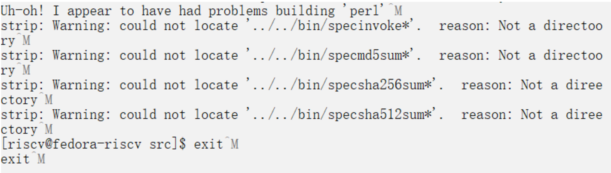
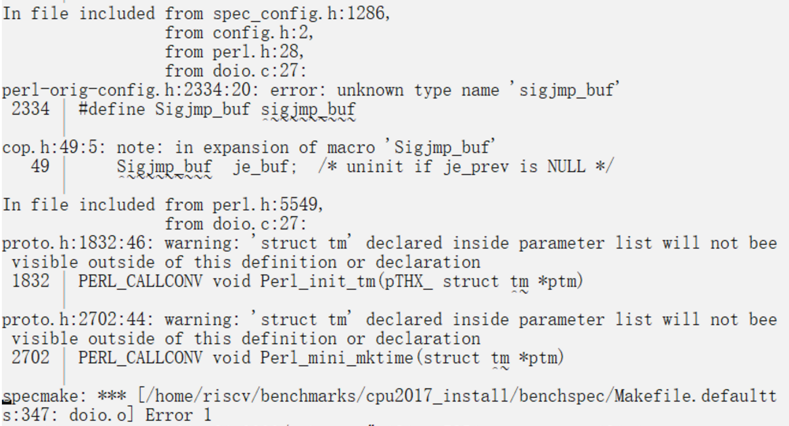

# 在Qemu Fedora for RV64中运行SPEC CPU 2017

### SPEC 2017 对系统的要求

  - 1 to 2 GB of main memory to run SPECrate (per copy); 16 GB for SPECspeed.
  - 250 GB disk space is recommended; a minimal installation needs 10 GB.
  - C, C++, and Fortran compilers (or a set of pre-compiled binaries from another CPU 2017 user).
  A variety of chips and operating systems are supported.

### 启动Qemu/Fedora for RV64

### 虚机的硬件资源

memory：4G

硬盘大小: 250G

对镜像Fedora-Minimal-Rawhide-20200108.n.0-sda.raw进行扩容。

## SPEC CPU2017

SPEC CPU的运行需要一些工具集，例如spectar、specperl等等，其实就是对常用工具的一些封装，但是必须使用spec提供的版本。但是SPEC官方并不支持RISCV架构，因此需要我们自己来编译spec的工具集。官网上有相应的指导文档：

https://www.spec.org/cpu2017/Docs/tools-build.html

编译过程中会遇到具体的问题，可以参考：

https://gitee.com/lvxiaoqian/memo/blob/master/%E5%9C%A8unmatched%20Ubuntu21.04%E4%B8%8A%E8%B7%91cpu2017.md

我自己的遇到的问题也记录在下一部分。

### 构建toolset过程中的错误记录

为了方便使用之后的packagetools工具，src目录需要解压在$SPEC/tools/目录下

#### 1. 替换掉config.guess和config.sub

下面几个工具需要更新config.guess和config.sub，本身这两个文件太旧了，无法识别出操作系统。

```
./specinvoke/config.guess
./specsum/build-aux/config.guess
./tar-1.28/build-aux/config.guess
./make-4.2.1/config/config.guess
./rxp-1.5.0/config.guess
./expat-2.1.0/conftools/config.guess
./xz-5.2.2/build-aux/config.guess
```

替换成下面两个比较新的文件

http://git.savannah.gnu.org/gitweb/?p=config.git;a=blob_plain;f=config.guess

http://git.savannah.gnu.org/gitweb/?p=config.git;a=blob_plain;f=config.sub

#### 2. Can't locate FindBin.pm

报错的信息是：
```
make[2]: Entering directory '/home/riscv/benchmarks/tools/src/make-4.2.1'^M
cd tests && perl ./run_make_tests.pl -srcdir /home/riscv/benchmarks/tools/src/maa
ke-4.2.1 -make ../make ^M
Can't locate FindBin.pm in @INC (you may need to install the FindBin module) (@II
NC contains: /usr/local/lib64/perl5/5.32 /usr/local/share/perl5/5.32 /usr/lib64//
perl5/vendor_perl /usr/share/perl5/vendor_perl /usr/lib64/perl5 /usr/share/perl55
) at ./run_make_tests.pl line 32.^M
BEGIN failed--compilation aborted at ./run_make_tests.pl line 32.^M
```

解决方法：`sudo dnf install perl`

#### 3. build perl在gcc10上面有bug


由于build perl在gcc10上面有bug，修改Configure和cflags.SH文件中case "$gccversion" in相关1*->1.*

#### 4. TimeDate的错误


是个bug，2020年以后跑test会出错，修改TimeDate-2.30/t/getdate.t

```
require Time::Local;
-my $offset = Time::Local::timegm(0,0,0,1,0,70);
+my $offset = Time::Local::timegm(0,0,0,1,0,1970);
```

#### 5. 根据实际情况修改SPECBIN



我的tools/src和cpu_mount在同一目录下（cpu_mount是CPU2017-1.1.8.iso挂载目录）

../../cpu_mount/tools/bin

修改变量SPECBIN=../../bin为SPECBIN=../../cpu_mount/tools/bin

#### 6. 只读权限问题


我的解决方法是将挂载点cpu_mount下的文件全部拷贝到新的文件夹下cpu2017下，然后给cpu2017文件夹添加写权限。

```
$ mkdir cpu2017
$ cp -r cpu_mount/* cpu2017/
$ chmod -R +w cpu2017
```

#### 7. missing makeinfo


sudo dnf install texinfo

#### 一些环境变量的设置

编译buildtools之前也可以设置一些环境变量，例如设置MAKEFLAGS来开启多线程编译：

```
$ export MAKEFLAGS=-j4
$ ./buildtools
```

#### 8. 执行buildtools过程中可能有的交互式输入 

Hey!  Some of the Perl tests failed!
If you think this is okay, enter y now:

输入y继续编译。

### 使用packagetools来生成$SPEC/tools/bin/linux-riscv64目录

执行buildtools脚本完成toolset的编译之后，就需要用packagetools来生成$SPEC/tools/bin/linux-riscv64目录。

注意，在上步执行buildtools时候，src目录需要解压在$SPEC/tools/目录下，在运行buildtools。

buildtools运行成功之后，会在$SPEC/bin目录下生成specperl、spectar、specxz等工具。

然后手动创建$SPEC/tools/bin/linux-riscv64和其中的description文件，description内容如下：

```shell
For riscv64 Linux systems
                              Built on Qemu Fedora  5.10.6-200.0.riscv64.fc33.rii
                              scv64 with GCC 10.3.1 20210422 (Red Hat 10.3.1-1)
```

最后回到$SPEC目录，在该目录下执行：

```shell
$ ./bin/packagetools linux-riscv64
```
执行完成会有如下提示：


就会自动生成$SPEC/tools/bin/linux-riscv64下的各种文件。


### 安装CPU2017

```shell
$ ./install.sh -u linux-riscv64 -d /home/riscv/benchmarks/cpu2017_install
```


### 配置config文件

#### GCC9和GCC10在config上的区别

注意config的160行：

```
%define GCCge10  # EDIT: remove the '#' from column 1 if using GCC 10 or later
```
如果GCC版本小于10的话，这一行是需要注释的，不然会报下面的错误：

```
gfortran: error: unrecognized command line option '-fallow-argument-mismatch'; dd id you mean '-Wno-argument-mismatch'?
```
因为-fallow-argument-mismatch是在GCC10中新引入的。

#### 从网上的config里的收获

- 使用jemalloc库

### 运行SPEC CPU

#### test run

运行完整的测试集之前，可以先指定`--size=test`来运行，即workload选择test，比较快就能运行完，可以测试一下你的config是否有问题。

```
$ runcpu --config=gcc-test.cfg --size=test --noreportable intrate
```

我在QEMU上运行test测试，消耗的时间是41847秒。

#### iterations=1 

一般在tuning阶段，为了缩短测试时间，我们可以设定`iterations=1`，每个小benchmark只跑一次，并且要指定`--noreportable`。

```
$ runcpu --config=gcc-test.cfg --noreportable --iterations=1 intrate
```

#### reportable run 

最后，要出一个可发布的有效报告，需要指定`--reportable`。

```
$ runcpu --config=gcc-test.cfg --reportable intrate
```

#### runcpu时候的错误



这个是config的配置问题。

#### fp 运行时报错

需要切换到root，设置stack size :

```shell
# ulimit -s unlimited
```

#### fp 621 peak error


#### fp speed 644 运行停不下来，直到VM被killed

检查一下stack size 还有config里面`define GCCge10`那一行
在docker0中单独运行了644，可以正常运行，报告编号005

#### 521 
