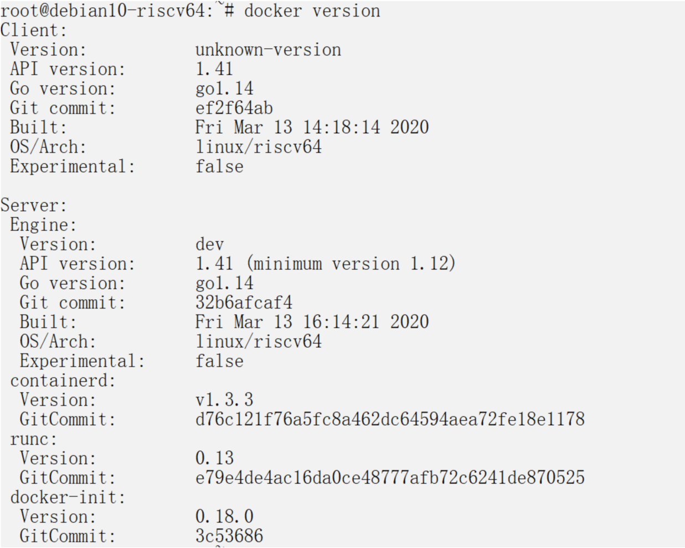

## 在qemu riscv64虚拟机中安装docker并运行riscv linux

下面的步骤在x86/Linux64下进行，需要你的机器上已经安装qemu-system-riscv64.

1. 下载基于Debian的RISCV虚拟机镜像。

```
$ wget https://github.com/carlosedp/riscv-bringup/releases/download/v1.0/debian-riscv64-QemuVM-202002.tar.gz

$ tar xvf debian-riscv64-QemuVM-202002.tar.gz

$ cd debian-riscv64-qemu

$ ./run_riscvVM.sh
```

2. 下载并安装Docker

```
$ wget https://github.com/carlosedp/riscv-bringup/releases/download/v1.0/docker-v19.03.8-dev_riscv64.deb

$ sudo apt install ./docker-19.03.8-dev_riscv64.deb
```
安装完之后重启虚拟机。

执行`docker info`和`docker version`验证docker是否正确安装




3. docker riscv/debian image 并启动容器

```
$ docker pull riscv64/debian:experimental

$ docker run -it riscv64/debian:experimental /bin/bash
```

容器启动成功会有如下的显示：


参考资料：

1. Docker Containers on RISC-V Architecture <https://carlosedp.medium.com/docker-containers-on-risc-v-architecture-5bc45725624b>
