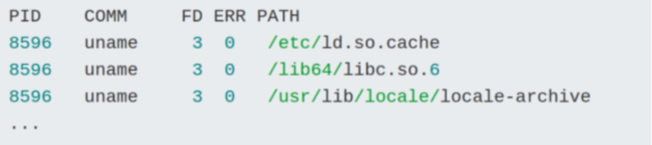
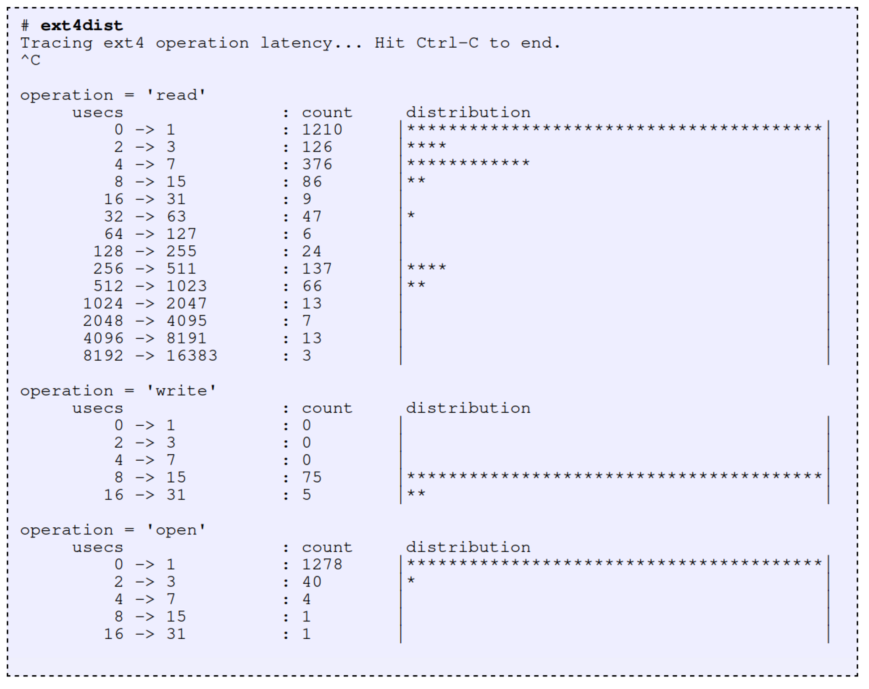
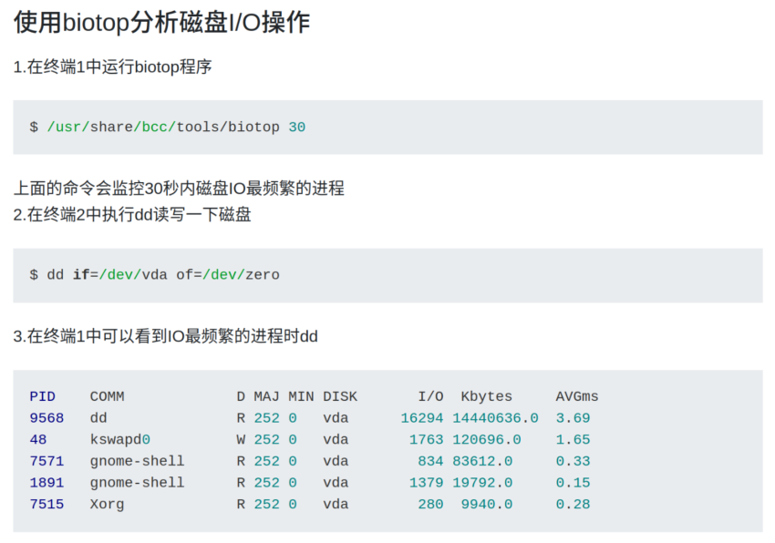

## Linux性能可观测工具图示


## 工具初级使用方法

### ubuntu安装bcc-tools

```shell
echo "deb [trusted=yes] https://repo.iovisor.org/apt/xenial xenial-nightly main" | sudo tee /etc/apt/sources.list.d/iovisor.list
sudo apt-get update
sudo apt-get install -y bcc-tools libbcc-examples python-bcc
```

运行工具报错：
```
$ sudo /usr/share/bcc/tools/filelife
Traceback (most recent call last):
  File "/usr/share/bcc/tools/filelife", line 21, in <module>
    from bcc import BPF
  File "/usr/lib/python2.7/dist-packages/bcc/__init__.py", line 27, in <module>
    from .libbcc import lib, bcc_symbol, bcc_symbol_option, bcc_stacktrace_build_id, _SYM_CB_TYPE
  File "/usr/lib/python2.7/dist-packages/bcc/libbcc.py", line 17, in <module>
    lib = ct.CDLL("libbcc.so.0", use_errno=True)
  File "/usr/lib/python2.7/ctypes/__init__.py", line 366, in __init__
    self._handle = _dlopen(self._name, mode)
OSError: libtinfo.so.5: cannot open shared object file: No such file or directory
```
解决方法：`$ sudo apt install libncurses5`

报错：

```shell
fatal error: too many errors emitted, stopping now [-ferror-limit=]
20 errors generated.
Traceback (most recent call last):
  File "./tcpconnect", line 223, in <module>
    b = BPF(text=bpf_text)
  File "/usr/lib/python2.7/dist-packages/bcc/__init__.py", line 343, in __init__
    raise Exception("Failed to compile BPF module %s" % (src_file or "<text>"))
Exception: Failed to compile BPF module <text>
```


### System Libraries

- **ltrace**

```shell
$ ltrace ./hello.out 
hello world!
+++ exited (status 0) +++
```

- **gethostlatency**

gh: https://github.com/iovisor/bcc/blob/master/tools/gethostlatency.py

https://github.com/iovisor/bpftrace/blob/master/tools/gethostlatency.bt

说明：

```
# gethostlatency  Show latency for getaddrinfo/gethostbyname[2] calls.
#                 For Linux, uses BCC, eBPF. Embedded C.
#
# This can be useful for identifying DNS latency, by identifying which
# remote host name lookups were slow, and by how much.
#
# This uses dynamic tracing of user-level functions and registers, and may
# need modifications to match your software and processor architecture.
#
# Copyright 2016 Netflix, Inc.
# Licensed under the Apache License, Version 2.0 (the "License")
#
# 28-Jan-2016    Brendan Gregg   Created this.
# 30-Mar-2016   Allan McAleavy updated for BPF_PERF_OUTPUT
```
用于跟踪DNS请求的延时。

### System Call Interface

- **strace**

```shell
$ strace ./hello.out 
execve("./hello.out", ["./hello.out"], 0x7ffc0651c5c0 /* 58 vars */) = 0
brk(NULL)                               = 0x555eba895000
arch_prctl(0x3001 /* ARCH_??? */, 0x7ffcba2869d0) = -1 EINVAL (无效的参数)
access("/etc/ld.so.preload", R_OK)      = -1 ENOENT (没有那个文件或目录)
openat(AT_FDCWD, "/etc/ld.so.cache", O_RDONLY|O_CLOEXEC) = 3
fstat(3, {st_mode=S_IFREG|0644, st_size=85485, ...}) = 0
mmap(NULL, 85485, PROT_READ, MAP_PRIVATE, 3, 0) = 0x7fd5b7c0f000
close(3)                                = 0
openat(AT_FDCWD, "/lib/x86_64-linux-gnu/libc.so.6", O_RDONLY|O_CLOEXEC) = 3
read(3, "\177ELF\2\1\1\3\0\0\0\0\0\0\0\0\3\0>\0\1\0\0\0\360q\2\0\0\0\0\0"..., 832) = 832
pread64(3, "\6\0\0\0\4\0\0\0@\0\0\0\0\0\0\0@\0\0\0\0\0\0\0@\0\0\0\0\0\0\0"..., 784, 64) = 784
pread64(3, "\4\0\0\0\20\0\0\0\5\0\0\0GNU\0\2\0\0\300\4\0\0\0\3\0\0\0\0\0\0\0", 32, 848) = 32
pread64(3, "\4\0\0\0\24\0\0\0\3\0\0\0GNU\0\t\233\222%\274\260\320\31\331\326\10\204\276X>\263"..., 68, 880) = 68
fstat(3, {st_mode=S_IFREG|0755, st_size=2029224, ...}) = 0
mmap(NULL, 8192, PROT_READ|PROT_WRITE, MAP_PRIVATE|MAP_ANONYMOUS, -1, 0) = 0x7fd5b7c0d000
pread64(3, "\6\0\0\0\4\0\0\0@\0\0\0\0\0\0\0@\0\0\0\0\0\0\0@\0\0\0\0\0\0\0"..., 784, 64) = 784
pread64(3, "\4\0\0\0\20\0\0\0\5\0\0\0GNU\0\2\0\0\300\4\0\0\0\3\0\0\0\0\0\0\0", 32, 848) = 32
pread64(3, "\4\0\0\0\24\0\0\0\3\0\0\0GNU\0\t\233\222%\274\260\320\31\331\326\10\204\276X>\263"..., 68, 880) = 68
mmap(NULL, 2036952, PROT_READ, MAP_PRIVATE|MAP_DENYWRITE, 3, 0) = 0x7fd5b7a1b000
mprotect(0x7fd5b7a40000, 1847296, PROT_NONE) = 0
mmap(0x7fd5b7a40000, 1540096, PROT_READ|PROT_EXEC, MAP_PRIVATE|MAP_FIXED|MAP_DENYWRITE, 3, 0x25000) = 0x7fd5b7a40000
mmap(0x7fd5b7bb8000, 303104, PROT_READ, MAP_PRIVATE|MAP_FIXED|MAP_DENYWRITE, 3, 0x19d000) = 0x7fd5b7bb8000
mmap(0x7fd5b7c03000, 24576, PROT_READ|PROT_WRITE, MAP_PRIVATE|MAP_FIXED|MAP_DENYWRITE, 3, 0x1e7000) = 0x7fd5b7c03000
mmap(0x7fd5b7c09000, 13528, PROT_READ|PROT_WRITE, MAP_PRIVATE|MAP_FIXED|MAP_ANONYMOUS, -1, 0) = 0x7fd5b7c09000
close(3)                                = 0
arch_prctl(ARCH_SET_FS, 0x7fd5b7c0e540) = 0
mprotect(0x7fd5b7c03000, 12288, PROT_READ) = 0
mprotect(0x555eba2f3000, 4096, PROT_READ) = 0
mprotect(0x7fd5b7c51000, 4096, PROT_READ) = 0
munmap(0x7fd5b7c0f000, 85485)           = 0
fstat(1, {st_mode=S_IFCHR|0620, st_rdev=makedev(0x88, 0x3), ...}) = 0
brk(NULL)                               = 0x555eba895000
brk(0x555eba8b6000)                     = 0x555eba8b6000
write(1, "hello world!\n", 13hello world!
)          = 13
exit_group(0)                           = ?
+++ exited with 0 +++

```

### VFS

- **opensnoop**

opensnoop跟踪打开的文件句柄

1. 在终端1中运行opensnoop程序

```shell
$ /usr/share/bcc/tools/opensnoop -n name
```

比如这个命令会跟踪uname命令打开的文件

2. 终端2中执行uname
3. 在终端1中会显示uname执行过程中打开的文件列表




https://segmentfault.com/a/1190000021488438

- **lsof**

lsof（list open files）是一个查看当前系统文件的工具。在linux环境下，任何事物都以文件的形式存在，通过文件不仅仅可以访问常规数据，还可以访问网络连接和硬件。如传输控制协议 (TCP) 和用户数据报协议 (UDP) 套接字等，系统在后台都为该应用程序分配了一个文件描述符，该文件描述符提供了大量关于这个应用程序本身的信息。

lsof打开的文件可以是：

    普通文件
    目录
    网络文件系统的文件
    字符或设备文件
    (函数)共享库
    管道，命名管道
    符号链接
    网络文件（例如：NFS file、网络socket，unix域名socket）
    还有其它类型的文件，等等

查看某个文件相关的进程
```shell
$lsof /bin/bash
COMMAND     PID USER  FD   TYPE DEVICE SIZE/OFF    NODE NAME
mysqld_sa  2169 root txt    REG  253,0   938736 4587562 /bin/bash
ksmtuned   2334 root txt    REG  253,0   938736 4587562 /bin/bash
bash      20121 root txt    REG  253,0   938736 4587562 /bin/bash
```

列出某个程序进程打开的文件信息

```shell
$ lsof -c chrome | more
COMMAND   PID  USER   FD      TYPE             DEVICE  SIZE/OFF    NODE NAME
chrome  66287 molly  cwd       DIR             259,11      4096 4849665 /home/molly
chrome  66287 molly  rtd       DIR             259,10      4096       2 /
chrome  66287 molly  txt       REG             259,10 172687360 1446375 /opt/google/chrome/chrome
chrome  66287 molly  DEL       REG               0,26                20 /dev/shm/.com.google.Chrome.pwLODw
chrome  66287 molly  DEL       REG               0,26                25 /dev/shm/.com.google.Chrome.ukiJvu
chrome  66287 molly  DEL       REG               0,26                73 /dev/shm/.com.google.Chrome.ZezSyx
chrome  66287 molly  DEL       REG               0,26                56 /dev/shm/.com.google.Chrome.WDY6gu
chrome  66287 molly  mem       REG             259,10    573112 3278976 /usr/lib/x86_64-linux-gnu/nss/libnssc
kbi.so
```

- **fatrace**

means "file access trace"

- **filelife**

跟踪文件的创建和删除，并提供有关谁删除了文件，文件使用期限和文件名的信息。目的是提供有关短期文件的信息，以进行调试或性能分析。

通过使用动态跟踪来跟踪内核vfs_create（）和vfs_delete（）函数（可能还有更多信息，请参见源代码）来工作，并且需要进行更新以匹配对这些函数的任何更改。

这利用了Linux 4.5功能（bpf_perf_event_output（））； 对于4.5之前的内核，请参阅tools/old下的版本，该版本使用了较旧的机制。

由于此操作使用BPF，因此只有root用户才能使用此工具。

示例：

```shell
        Trace all short-lived files, and print details:
              # filelife

       Trace all short-lived files created AND deleted by PID 181:
              # filelife -p 181
```

- **pcstat**

查看文件或数据是否被linux系统缓存了。适用的场景有数据库调优和IO密集型应用的性能分析。

gh：https://github.com/tobert/pcstat

### File System

- **ext4dist**

gh: https://github.com/iovisor/bcc/blob/master/tools/ext4dist.py

通常在块设备层研究存储I/O性能问题，但是对文件系统进行检测提供了更多相关的指标，以了解如何影响应用程序。

Brendan Gregg的ext4dist工具针对ext4文件系统执行此操作，并跟踪读取，写入，打开和fsync，并将其延迟汇总为2的幂的直方图。 例如： 


此输出显示读取延迟的双峰分布，其中小于7微秒的较快模式和256至1023微秒之间的较慢模式。计数列显示有多少事件落入该延迟范围。较快的模式很可能是内存中文件系统缓存中的命中点，而较慢的模式很可能是从存储设备（磁盘）中读取的。

从从VFS接口向文件系统发出操作到完成操作之间的时间，测量“延迟”。它涵盖了所有内容：块设备I / O（磁盘I / O），文件系统CPU周期，文件系统锁定，运行队列等待时间等。这比测量文件系统更好地衡量了从文件系统读取应用程序所遭受的等待时间。在块设备界面。在块设备级别进行测量更适合其他用途：资源容量规划。

请注意，此工具仅跟踪先前列出的常见文件系统操作：不跟踪其他文件系统操作（例如，包括getattr（）的inode操作）。

ext4dist是一个bcc工具，它通过BPF使用内核动态跟踪（通过kprobes）。 bcc是一个前端，并且是使用新的Linux增强BPF跟踪功能的工具的集合。 

- **ext4slower**

ext4slower，用以跟踪比自定义阈值慢的ext4操作。 例如1毫秒：



### Volume Manager

- **mdflush**

gh: https://github.com/iovisor/bcc/blob/master/tools/mdflush.

该工具跟踪md的flush事件。md是linux的多设备驱动程序（软件RAID）。flush的时间戳和md设备将被打印出来。了解flush发生的时间有助于理解磁盘的延迟峰值。

该工具通过动态跟踪内核md_flush_request（）函数来实现，并且需要进行更新以匹配对该函数的任何更改。

请注意，刷新本身很可能源自I/O堆栈中较高的位置，例如文件系统。

由于此操作使用BPF，因此只有root用户才能使用此工具。 

### Block Device

- **iostat**

iostat 命令是 I/O statistics(输入/输出统计)的缩写，用来报告系统的 CPU 统计信息和块设备及其分区的 IO 统计信息。iostat 是 sysstat 工具集的一个工具，在 Ubuntu 系统中默认是不带 iostat 命令的，需要自行安装。

iostat 也有一个弱点，就是它不能对某个进程进行深入分析，仅对系统的整体情况进行分析。

```shell
$ sudo apt install sysstat
```

```shell
$ iostat
Linux 5.8.0-50-generic 	2021年05月18日 	_x86_64_	(8 CPU)

avg-cpu:  %user   %nice %system %iowait  %steal   %idle
           0.24    0.01    0.12    0.03    0.00   99.61

Device             tps    kB_read/s    kB_wrtn/s    kB_dscd/s    kB_read    kB_wrtn    kB_dscd
loop0             0.00         0.00         0.00         0.00        347          0          0
loop1             0.00         0.02         0.00         0.00       5353          0          0
loop10            0.00         0.05         0.00         0.00      14826          0          0
loop11            0.00         0.00         0.00         0.00         14          0          0
loop2             0.00         0.03         0.00         0.00       7840          0          0
loop3             0.00         0.00         0.00         0.00       1447          0          0
loop4             0.00         0.04         0.00         0.00      12233          0          0
loop5             0.00         0.00         0.00         0.00       1093          0          0
loop6             0.00         0.00         0.00         0.00       1065          0          0
loop7             0.00         0.00         0.00         0.00        358          0          0
loop8             0.00         0.00         0.00         0.00       1089          0          0
loop9             0.00         0.05         0.00         0.00      15162          0          0
nvme0n1           1.44         8.17        27.22       163.10    2458339    8195529   49102146

```

- **biosnoop**

gh: https://github.com/iovisor/bcc/blob/master/tools/biosnoop.py

```shell
# biosnoop  Trace block device I/O and print details including issuing PID.
#           For Linux, uses BCC, eBPF.
#
# This uses in-kernel eBPF maps to cache process details (PID and comm) by I/O
# request, as well as a starting timestamp for calculating I/O latency.
```
- **biolatency**

gh: https://github.com/iovisor/bcc/blob/master/tools/biolatency.py

Summarize block device I/O latency as a histogram. For Linux, uses BCC, eBPF.

The latency of disk I/O operations is measured from when requests are issued to the device up to comple

- **biotop**

gh: https://github.com/iovisor/bcc/blob/master/tools/biotop.py



- **blktrace**

追踪IO过程的工具。

### Sockets

- **ss**

ss is used to dump socket statistics. It allows showing information similar to netstat.  It can display more TCP and state information than other tools.

```shell

$ ss
v_str     ESTAB       0          0                           *:2061133939                      2:50001
v_str     ESTAB       0          0                           *:2061133940                      2:50000
v_str     ESTAB       0          0                           *:2061133941                      2:50000
v_str     ESTAB       0          0                           *:2061133943                      2:50002
v_str     ESTAB       0          0                           *:2061133944                      2:50002
v_str     ESTAB       0          0                           *:2061133937                      2:50000
v_str     ESTAB       0          0                           *:2061133938                      2:50000
v_str     ESTAB       0          0                           *:2061133942                      2:750803010
v_str     ESTAB       0          0                           *:2061133942                      2:750803009
v_str     ESTAB       0          0                           *:2061133942                      2:750803008
v_str     ESTAB       0          0                           *:2061133942                      2:750803007
v_str     ESTAB       0          0                           *:2061133942                      2:750803001
v_str     ESTAB       0          0                           *:2061133942                      2:750802999
v_str     ESTAB       0          0                           *:2061133942                      2:750802998
v_str     ESTAB       0          0                           *:2061133942                      2:750802995
v_str     ESTAB       0          0                           *:2061133942                      2:750802994
v_str     ESTAB       0          0                           *:2061133942                      2:750802993
v_str     ESTAB       0          0                           *:2061133942                      2:750802992
v_str     ESTAB       0          0                           *:2061133942                      2:750802988
v_str     ESTAB       0          0                           *:2061133942                      2:750802987
v_str     ESTAB       0          0                           *:2061133942                      2:750802297
v_str     ESTAB       0          0                           *:2061133942                      2:750802263
v_str     ESTAB       0          0                           *:2061133946                      2:750802106
v_str     ESTAB       0          0                           *:2061133947                      2:750802110
```

### TCP/UDP

- **nstat**

nstat是一个简单的监视内核的SNMP计数器和网络接口状态的实用工具。

```shell
$ nstat
#kernel
IpInReceives                    10                 0.0
IpInDelivers                    10                 0.0
IpOutRequests                   13                 0.0
TcpInSegs                       8                  0.0
TcpOutSegs                      8                  0.0
UdpInDatagrams                  2                  0.0
UdpOutDatagrams                 5                  0.0
TcpExtTCPHPAcks                 4                  0.0
TcpExtTCPOrigDataSent           4                  0.0
TcpExtTCPDelivered              4                  0.0
IpExtInOctets                   787                0.0
IpExtOutOctets                  1192               0.0
IpExtInNoECTPkts                10                 0.0
```

- **tcplife**

gh: https://github.com/iovisor/bcc/blob/master/tools/tcplife.py

tcplife是一个基于 eBPF 的工具，可以显示完整的 TCP session, 以及对应的进程号(PID) ，命令(COMM)，收发字节数(TX_KB, RX_KB)，以及时长(MS)。

- **tcpretrans**

show TCP retransmits, with address and other details. Uses Linux ftrace.

显示TCP重新传输以及地址和其他详细信息。 使用Linux ftrace。 

- **udpconnect**

### IP

- **nstat**

### Net Device

- **tcpdump**

tcpdump是一个运行在命令行下的数据包分析器。它允许用户拦截和显示发送或收到过网络连接到该计算机的TCP/IP和其他数据包。tcpdump 是一个在BSD许可证下发布的自由软件。 

### Scheduler

- **execsnoop**

gh： https://github.com/brendangregg/perf-tools/blob/master/execsnoop

execsnoop-专门用于为追踪短时进程（瞬时进程）设计的工具；它通过 ftrace 实时监控进程的 exec() 行为，并输出短时进程的基本信息，包括进程 PID、父进程 PID、命令行参数以及执行的结果。

- **mpstat**

mpstat是Multiprocessor Statistics的缩写，是实时系统监控工具。其报告与CPU的一些统计信息，这些信息存放在/proc/stat文件中。在多CPUs系统里，其不但能查看所有CPU的平均状况信息，而且能够查看特定CPU的信息。mpstat最大的特点是：可以查看多核心cpu中每个计算核心的统计数据；而类似工具vmstat只能查看系统整体cpu情况。

```shell
$ mpstat -P ALL
Linux 4.19.128-microsoft-standard      05/20/21        _x86_64_        (8 CPU)

02:46:49     CPU    %usr   %nice    %sys %iowait    %irq   %soft  %steal  %guest  %gnice   %idle
02:46:49     all    0.06    0.02    0.17    0.00    0.00    0.01    0.00    0.00    0.00   99.74
02:46:49       0    0.07    0.00    0.21    0.00    0.00    0.03    0.00    0.00    0.00   99.69
02:46:49       1    0.05    0.01    0.24    0.00    0.00    0.02    0.00    0.00    0.00   99.68
02:46:49       2    0.07    0.03    0.36    0.00    0.00    0.01    0.00    0.00    0.00   99.52
02:46:49       3    0.04    0.06    0.07    0.00    0.00    0.01    0.00    0.00    0.00   99.81
02:46:49       4    0.06    0.01    0.15    0.00    0.00    0.01    0.00    0.00    0.00   99.77
02:46:49       5    0.05    0.02    0.07    0.00    0.00    0.01    0.00    0.00    0.00   99.85
02:46:49       6    0.06    0.00    0.13    0.00    0.00    0.01    0.00    0.00    0.00   99.79
02:46:49       7    0.06    0.01    0.09    0.00    0.00    0.01    0.00    0.00    0.00   99.83
```

- **profile**

- **runqlen**

gh: https://github.com/iovisor/bcc/blob/master/tools/runqlen.py

runqlen是一个BCC和bpftrace工具，用于对CPU运行队列的长度进行采样，计算有多少任务在等待轮到他们，并将其显示为线性直方图。这可以用来进一步描述运行队列延迟的问题或作为更便宜的近似值。

- **offcputime**

gh: https://github.com/iovisor/bcc/blob/master/tools/offcputime.py

先了解什么是off-cpu

    On-CPU: where threads are spending time running on-CPU.
    Off-CPU: where time is spent waiting while blocked on I/O, locks, timers, paging/swapping, etc.

从上面的意思基本上了解offcputime的意思是什么了:用于测量某一进程被阻塞的时间。

- **softirqs**

gh: https://github.com/iovisor/bcc/blob/master/tools/softirqs.py

Summarize soft IRQ (interrupt) event time.  For Linux, uses BCC, eBPF.

### Virtual Memory

- **vmstat**

vmstat命令是最常见的Linux/Unix监控工具，可以展现给定时间间隔的服务器的状态值,包括服务器的CPU使用率，内存使用，虚拟内存交换情况,IO读写情况。

一般vmstat工具的使用是通过两个数字参数来完成的，第一个参数是采样的时间间隔数，单位是秒，第二个参数是采样的次数。

```shell
$ vmstat 2 5
procs -----------memory---------- ---swap-- -----io---- -system-- ------cpu-----
 r  b   swpd   free   buff  cache   si   so    bi    bo   in   cs us sy id wa st
 1  0      0 12624888  13960 200940    0    0     6   130   16   56  0  0 100  0  0
 0  0      0 12624912  13960 200940    0    0     0     0  141  534  0  0 100  0  0
 0  0      0 12624912  13960 200940    0    0     0     0  138  521  0  0 100  0  0
 0  0      0 12624912  13960 200940    0    0     0     0  162  579  0  0 100  0  0
 0  0      0 12624912  13960 200940    0    0     0     0  156  567  0  0 100  0  0
```

- **slabtop**

实时显示内核slab内存缓存信息。

内核的模块在分配资源的时候，为了提高效率和资源的利用率，都是透过slab来分配的。通过slab的信息，再配合源码能粗粗了解系统的运行情况，比如说什么资源有没有不正常的多，或者什么资源有没有泄漏。linux系统透过/proc/slabinfo来向用户暴露slab的使用情况。

Linux 所使用的 slab 分配器的基础是 Jeff Bonwick 为 SunOS 操作系统首次引入的一种算法。Jeff 的分配器是围绕对象缓存进行的。在内核中，会为有限的对象集（例如文件描述符和其他常见结构）分配大量内存。Jeff 发现对内核中普通对象进行初始化所需的时间超过了对其进行分配和释放所需的时间。因此他的结论是不应该将内存释放回一个全局的内存池，而是将内存保持为针对特定目而初始化的状态。Linux slab 分配器使用了这种思想和其他一些思想来构建一个在空间和时间上都具有高效性的内存分配器。

保存着监视系统中所有活动的 slab 缓存的信息的文件为/proc/slabinfo。

- **free**

可以显示当前系统未使用的和已使用的内存数目，还可以显示被内核使用的内存缓冲区。

```shell
$ free -m
              total        used        free      shared  buff/cache   available
Mem:          12653         115       12327           0         210       12296
Swap:          4096           0        4096
```

### Device Drivers

- **hardirqs**

Measure hard IRQ (hard interrupt) event time. Uses Linux eBPF/bcc.

- **criticalstat**

gh：https://github.com/iovisor/bcc/blob/master/tools/criticalstat.py

Trace long critical sections (IRQs or preemption disabled).

For Linux, uses BCC, eBPF. Requires kernel built with CONFIG_DEBUG_PREEMPT and CONFIG_PREEMPTIRQ_EVENTS.

### 参考资料:

1. http://www.brendangregg.com/linuxperf.html

2. https://zhuanlan.zhihu.com/p/32027979

3. ltrace命令详解

https://www.cnblogs.com/machangwei-8/p/10388938.html

4. lsof 一切皆文件

https://linuxtools-rst.readthedocs.io/zh_CN/latest/tool/lsof.html

5. fatrace: report system wide file access events

https://piware.de/2012/02/fatrace-report-system-wide-file-access-events/

6. filelife - Trace the lifespan of short-lived files ... - Ubuntu Manpage

http://manpages.ubuntu.com/manpages/bionic/man8/filelife-bpfcc.8.html

7. 使用BCC工具分析系统性能

https://segmentfault.com/a/1190000021488438

8. ubuntu18.04安装bcc-tools

https://gnuser.github.io/2020/06/19/ubuntu18.04%E5%AE%89%E8%A3%85bcc-tools.html

9. Linux bcc ext4 Latency Tracing

http://www.brendangregg.com/blog/2016-10-06/linux-bcc-ext4dist-ext4slower.html

10. mdflush - Trace md flush events. Uses ... - Ubuntu Manpage

http://manpages.ubuntu.com/manpages/bionic/man8/mdflush-bpfcc.8.html

11. Linux iostat 命令

https://www.cnblogs.com/sparkdev/p/10427049.html

12. biolatency - Summarize block device I/O latency as a histogram. 

https://manpages.debian.org/unstable/bpfcc-tools/biolatency-bpfcc.8.en.html

13. IO神器blktrace使用介绍

https://developer.aliyun.com/article/698568

14. Using the nstat network statistics command in Linux

https://www.redhat.com/sysadmin/nstat-command-linux

15. eBPF Tracing 入门教程与实例

https://segmentfault.com/a/1190000019316746

16. Man page of TCPDUMP

https://www.tcpdump.org/manpages/tcpdump.1.html

17. execsnoop-短时进程追踪工具

https://blog.51cto.com/liuzhengwei521/2419139

18. Linux CPU实时监控mpstat命令详解

https://www.cnblogs.com/ggjucheng/archive/2013/01/13/2858775.html

19. 高性能：7-可用于CPU分析的BPF工具【bpf performance tools读书笔记

https://blog.51cto.com/lee90/2475804

20. bcc-tools工具之offcputime

https://www.cnblogs.com/haoxing990/p/12203997.html

21. Linux vmstat命令实战详解

https://www.cnblogs.com/ggjucheng/archive/2012/01/05/2312625.html

22. slabtop

https://wangchujiang.com/linux-command/c/slabtop.html

23. free

https://wangchujiang.com/linux-command/c/free.html

24. hardirqs

http://manpages.ubuntu.com/manpages/bionic/man8/hardirqs-bpfcc.8.html
