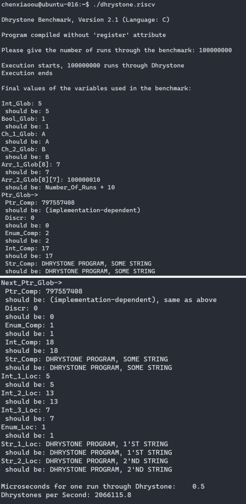
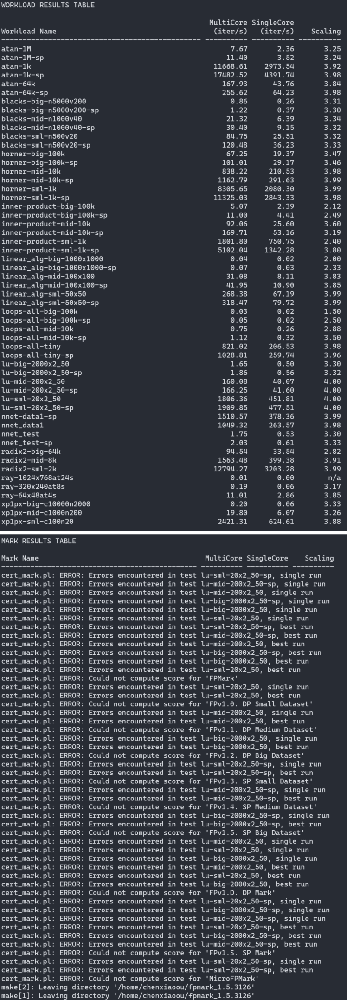
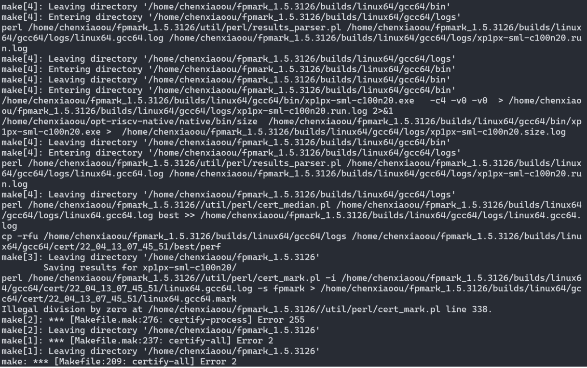
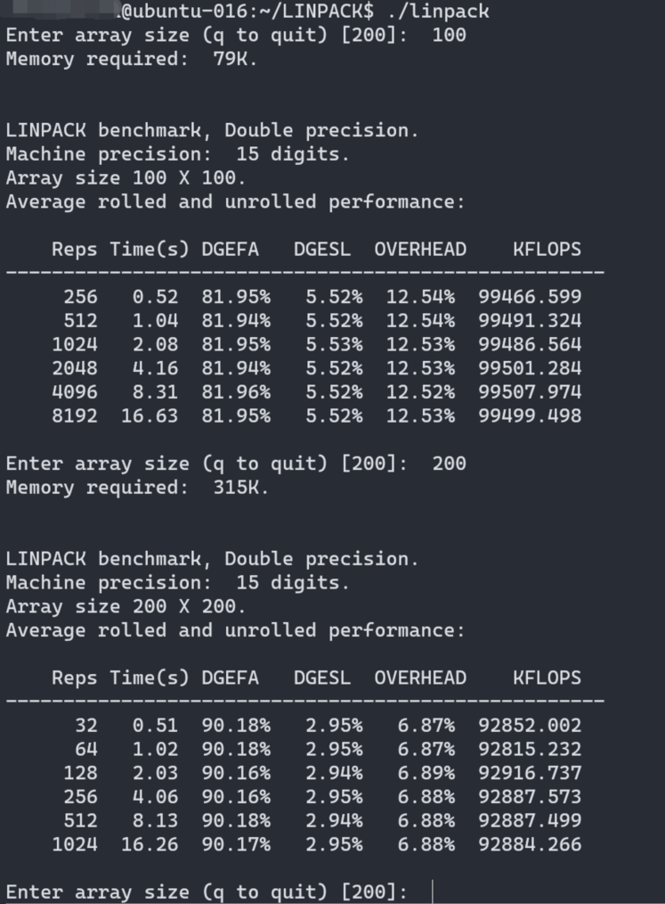

# 在Unleashed、Unmatched和D1三款开发板上的性能测试对比

本文汇总了我们在RISCV三款开发板上的测试工作，这三块开发板分别是Unleashed、Unmatched和D1。

我们分析过的Benchmark有Embench, Dhrystone, FPMark, Linpack, Whetstone, Coremark。

这三款开发板上的性能对比汇总如下图：


详细的测试过程和数据列在下面。

## 系统信息

### unleashed系统信息：
```
lsb_release -a
]No LSB modules are available.
Distributor ID: Ubuntu
Description:    Ubuntu 21.10
Release:        21.10
Codename:       impish
```
GCC 版本：11.2.0

### unmatched的系统信息：

```
$ lsb_release -a
No LSB modules are available.
Distributor ID: Ubuntu
Description:    Ubuntu 21.04
Release:        21.04
Codename:       hirsute
```
### oE系统信息：
```
# uname -a 
Linux openEuler-RISCV-rare 5.4.61 #20 SMP Thu Aug 26 11:50:01 CST 2021 riscv64 riscv64 riscv64 GNU/Linux
```


## Embench

目前Embench不支持rv64，参见：
https://github.com/embench/embench-iot/issues/159

## Dhrystone

- Dhrystone在unleashed上运行：


- Dhrystone在unmatched上运行：



- Dhrystone在D1上运行：


## FPMark

测试在unmatched，使用最新的GNU工具链编译FPMark并运行。

### 编译native GNU工具链

在x86上交叉编译rv64 native GNU工具链。

```
$ cd riscv-gnu-toolchain
$ mkdir build-riscv-native && cd build-riscv-native/
$ ../configure --prefix=/home/cxo/opt-riscv-native
$ make linux-native -j 52
```

报错：
```
cfenv:77:11: error: 'feupdateenv' has not been declared in '::'
```

解决方法： https://gcc.gnu.org/bugzilla/attachment.cgi?id=51747&action=edit


### 编译运行FPMark

运行命令：
```
$ export C_INCLUDE_PATH=/home/chenxiaoou/opt-riscv-native/sysroot/usr/include
$ export CPLUS_INCLUDE_PATH=/home/chenxiaoou/opt-riscv-native/sysroot/usr/include
$ export LD_LIBRARY_PATH=/home/chenxiaoou/opt-riscv-native/sysroot/usr/lib:/home/chenxiaoou/opt-riscv-native/native/lib:/home/chenxiaoou/opt-riscv-native/sysroot/lib
$ export LIBRARY_PATH=/home/chenxiaoou/opt-riscv-native/sysroot/usr/lib:/home/chenxiaoou/opt-riscv-native/native/lib:/home/chenxiaoou/opt-riscv-native/sysroot/lib
$ sudo /sbin/ldconfig6
$ cd fpmark_1.5.3126
$ make certify-all XCMD='-c4'
```

#### issue1

```
/home/chenxiaoou/opt-riscv-native/native/bin/gcc  -o/home/chenxiaoou/fpmark_1.5.3126/builds/linux64/gcc64/bin/xp1px-sml-c100n20.exe xp1px-sml-c100n20.o /home/chenxiaoou/fpmark_1.5.3126/builds/linux64/gcc64/obj/bench/fp/FC_xp1px/*.o  /home/chenxiaoou/fpmark_1.5.3126/builds/linux64/gcc64/obj/mith.a -lm -lrt -lpthread -lm -lrt -lpthread
/home/chenxiaoou/opt-riscv-native/native/bin/../lib/gcc/riscv64-unknown-linux-gnu/11.1.0/../../../../riscv64-unknown-linux-gnu/bin/ld: cannot find /lib/libc.so.6: No such file or directory
/home/chenxiaoou/opt-riscv-native/native/bin/../lib/gcc/riscv64-unknown-linux-gnu/11.1.0/../../../../riscv64-unknown-linux-gnu/bin/ld: cannot find /usr/lib/libc_nonshared.a: No such file or directory
collect2: error: ld returned 1 exit status
```

解决方法：
```
sudo ln -s /home/chenxiaoou/opt-riscv-native/sysroot/lib/libc.so.6 /lib/libc.so.6
sudo ln -s /home/chenxiaoou/opt-riscv-native/sysroot/usr/lib/libc_nonshared.a /usr/lib/libc_nonshared.a
```

#### issue2

```
perl /home/chenxiaoou/fpmark_1.5.3126/util/perl/results_parser.pl /home/chenxiaoou/fpmark_1.5.3126/builds/linux64/gcc64/logs/linux64.gcc64.log /home/chenxiaoou/fpmark_1.5.3126/builds/linux64/gcc64/logs/xp1px-sml-c100n20.run.log
perl: /home/chenxiaoou/opt-riscv-native/sysroot/lib/libcrypt.so.1: version `XCRYPT_2.0' not found (required by perl)
```

解决方法：
```
ln -s /usr/lib/riscv64-linux-gnu/libcrypt.so.1 ~/opt-riscv-native/sysroot/lib/libcrypt.so.1
```

#### Result
(unmatched016 /home/chenxiaoou/fpmark_1.5.3126/builds/linux64/gcc64/cert/22_04_11_08_02_43/linux64.gcc64.mark)


#### -v0

默认开启了校验模式，lu程序的校验无法通过，也就没有最后Mark Result，可以通过`-v0`关闭校验。

命令：
```
make certify-all XCMD='-c4 -v0'
```



出错的cert_mark.pl line 338
```
printf "%-47s %10.2f %10.2f %10.2f\n", $mark, $best, $single, $best / $single
```

## Linpack

源码：

http://reports.ias.ac.in/report/21074/detecting-floating-point-exceptions-in-risc-v-using-gcc

编译命令：
```
gcc -O -o linpack linpack.c -lm
```

在Unleashed上运行结果：


在Unmatched上运行结果：



在D1上运行结果：


## Whetstone

源码：

http://reports.ias.ac.in/report/21074/detecting-floating-point-exceptions-in-risc-v-using-gcc

编译命令：
```
gcc -O -o whetstone whetstone.c -lm
```

在Unleashed上运行结果：


在Unmatched上运行结果：


在D1上运行结果：


## Coremark

### unleashed

在unleashed上执行：
```
$ cd coremark_v1.0
$ make XCFLAGS="-DMULTITHREAD=4 -DUSE_FORK" ITERATIONS=150000 PORT_DIR=rv64
```

run1.log:
```
2K performance run parameters for coremark.
CoreMark Size    : 666
Total ticks      : 70540
Total time (secs): 70.540000
Iterations/Sec   : 8505.812305
Iterations       : 600000
Compiler version : GCC11.2.0
Compiler flags   : -O2 -DMULTITHREAD=4 -DUSE_FORK -DPERFORMANCE_RUN=1  -lrt
Parallel Fork : 4
Memory location  : Please put data memory location here
                        (e.g. code in flash, data on heap etc)
seedcrc          : 0xe9f5
[0]crclist       : 0xe714
[1]crclist       : 0xe714
[2]crclist       : 0xe714
[3]crclist       : 0xe714
[0]crcmatrix     : 0x1fd7
[1]crcmatrix     : 0x1fd7
[2]crcmatrix     : 0x1fd7
[3]crcmatrix     : 0x1fd7
[0]crcstate      : 0x8e3a
[1]crcstate      : 0x8e3a
[2]crcstate      : 0x8e3a
[3]crcstate      : 0x8e3a
[0]crcfinal      : 0x25b5
[1]crcfinal      : 0x25b5
[2]crcfinal      : 0x25b5
[3]crcfinal      : 0x25b5
Correct operation validated. See readme.txt for run and reporting rules.
CoreMark 1.0 : 8505.812305 / GCC11.2.0 -O2 -DMULTITHREAD=4 -DUSE_FORK -DPERFORMANCE_RUN=1  -lrt / Heap / 4:Fork
```

run2.log:
```
2K validation run parameters for coremark.
CoreMark Size    : 666
Total ticks      : 70623
Total time (secs): 70.623000
Iterations/Sec   : 8495.815811
Iterations       : 600000
Compiler version : GCC11.2.0
Compiler flags   : -O2 -DMULTITHREAD=4 -DUSE_FORK -DPERFORMANCE_RUN=1  -lrt
Parallel Fork : 4
Memory location  : Please put data memory location here
                        (e.g. code in flash, data on heap etc)
seedcrc          : 0x18f2
[0]crclist       : 0xe3c1
[1]crclist       : 0xe3c1
[2]crclist       : 0xe3c1
[3]crclist       : 0xe3c1
[0]crcmatrix     : 0x0747
[1]crcmatrix     : 0x0747
[2]crcmatrix     : 0x0747
[3]crcmatrix     : 0x0747
[0]crcstate      : 0x8d84
[1]crcstate      : 0x8d84
[2]crcstate      : 0x8d84
[3]crcstate      : 0x8d84
[0]crcfinal      : 0x6225
[1]crcfinal      : 0x6225
[2]crcfinal      : 0x6225
[3]crcfinal      : 0x6225
Correct operation validated. See readme.txt for run and reporting rules.
```

### unmatched

在unmatched上执行：

```
$ cd coremark_v1.0
$ make clean
$ make XCFLAGS="-DMULTITHREAD=4 -DUSE_FORK" ITERATIONS=150000 PORT_DIR=rv64
```

结果如下：

run1.log:
```
2K performance run parameters for coremark.
CoreMark Size    : 666
Total ticks      : 48530
Total time (secs): 48.530000
Iterations/Sec   : 12363.486503
Iterations       : 600000
Compiler version : GCC10.3.0
Compiler flags   : -O2 -DMULTITHREAD=4 -DUSE_FORK -DPERFORMANCE_RUN=1  -lrt
Parallel Fork : 4
Memory location  : Please put data memory location here
                        (e.g. code in flash, data on heap etc)
seedcrc          : 0xe9f5
[0]crclist       : 0xe714
[1]crclist       : 0xe714
[2]crclist       : 0xe714
[3]crclist       : 0xe714
[0]crcmatrix     : 0x1fd7
[1]crcmatrix     : 0x1fd7
[2]crcmatrix     : 0x1fd7
[3]crcmatrix     : 0x1fd7
[0]crcstate      : 0x8e3a
[1]crcstate      : 0x8e3a
[2]crcstate      : 0x8e3a
[3]crcstate      : 0x8e3a
[0]crcfinal      : 0x25b5
[1]crcfinal      : 0x25b5
[2]crcfinal      : 0x25b5
[3]crcfinal      : 0x25b5
Correct operation validated. See readme.txt for run and reporting rules.
CoreMark 1.0 : 12363.486503 / GCC10.3.0 -O2 -DMULTITHREAD=4 -DUSE_FORK -DPERFORMANCE_RUN=1  -lrt / Heap / 4:Fork
```

run2.log：
```
2K validation run parameters for coremark.
CoreMark Size    : 666
Total ticks      : 48595
Total time (secs): 48.595000
Iterations/Sec   : 12346.949275
Iterations       : 600000
Compiler version : GCC10.3.0
Compiler flags   : -O2 -DMULTITHREAD=4 -DUSE_FORK -DPERFORMANCE_RUN=1  -lrt
Parallel Fork : 4
Memory location  : Please put data memory location here
                        (e.g. code in flash, data on heap etc)
seedcrc          : 0x18f2
[0]crclist       : 0xe3c1
[1]crclist       : 0xe3c1
[2]crclist       : 0xe3c1
[3]crclist       : 0xe3c1
[0]crcmatrix     : 0x0747
[1]crcmatrix     : 0x0747
[2]crcmatrix     : 0x0747
[3]crcmatrix     : 0x0747
[0]crcstate      : 0x8d84
[1]crcstate      : 0x8d84
[2]crcstate      : 0x8d84
[3]crcstate      : 0x8d84
[0]crcfinal      : 0x6225
[1]crcfinal      : 0x6225
[2]crcfinal      : 0x6225
[3]crcfinal      : 0x6225
Correct operation validated. See readme.txt for run and reporting rules.
```

### D1

```
$ cd coremark_v1.0
$ make clean
$ make XCFLAGS="-DMULTITHREAD=4 -DUSE_FORK" ITERATIONS=150000 PORT_DIR=rv64
```

结果如下：

run1.log
```
2K performance run parameters for coremark.
CoreMark Size    : 666
Total ticks      : 268183
Total time (secs): 268.183000
Iterations/Sec   : 2237.278276
Iterations       : 600000
Compiler version : GCC9.3.1
Compiler flags   : -O2 -DMULTITHREAD=4 -DUSE_FORK -DPERFORMANCE_RUN=1  -lrt
Parallel Fork : 4
Memory location  : Please put data memory location here
                        (e.g. code in flash, data on heap etc)
seedcrc          : 0xe9f5
[0]crclist       : 0xe714
[1]crclist       : 0xe714
[2]crclist       : 0xe714
[3]crclist       : 0xe714
[0]crcmatrix     : 0x1fd7
[1]crcmatrix     : 0x1fd7
[2]crcmatrix     : 0x1fd7
[3]crcmatrix     : 0x1fd7
[0]crcstate      : 0x8e3a
[1]crcstate      : 0x8e3a
[2]crcstate      : 0x8e3a
[3]crcstate      : 0x8e3a
[0]crcfinal      : 0x25b5
[1]crcfinal      : 0x25b5
[2]crcfinal      : 0x25b5
[3]crcfinal      : 0x25b5
Correct operation validated. See readme.txt for run and reporting rules.
CoreMark 1.0 : 2237.278276 / GCC9.3.1 -O2 -DMULTITHREAD=4 -DUSE_FORK -DPERFORMANCE_RUN=1  -lrt / Heap / 4:Fork
```

run2.log
```
2K validation run parameters for coremark.
CoreMark Size    : 666
Total ticks      : 269008
Total time (secs): 269.008000
Iterations/Sec   : 2230.416939
Iterations       : 600000
Compiler version : GCC9.3.1
Compiler flags   : -O2 -DMULTITHREAD=4 -DUSE_FORK -DPERFORMANCE_RUN=1  -lrt
Parallel Fork : 4
Memory location  : Please put data memory location here
                        (e.g. code in flash, data on heap etc)
seedcrc          : 0x18f2
[0]crclist       : 0xe3c1
[1]crclist       : 0xe3c1
[2]crclist       : 0xe3c1
[3]crclist       : 0xe3c1
[0]crcmatrix     : 0x0747
[1]crcmatrix     : 0x0747
[2]crcmatrix     : 0x0747
[3]crcmatrix     : 0x0747
[0]crcstate      : 0x8d84
[1]crcstate      : 0x8d84
[2]crcstate      : 0x8d84
[3]crcstate      : 0x8d84
[0]crcfinal      : 0x6225
[1]crcfinal      : 0x6225
[2]crcfinal      : 0x6225
[3]crcfinal      : 0x6225
Correct operation validated. See readme.txt for run and reporting rules.
```

D1只有一个物理核心：
```
# cat /proc/cpuinfo 
processor	: 0
hart		: 0
isa		: rv64imafdcvu
mmu		: sv39
```

又测了一下单线程：

```
$ make clean
$ make ITERATIONS=150000 PORT_DIR=rv64
```

结果如下：

run1.log
```
2K performance run parameters for coremark.
CoreMark Size    : 666
Total ticks      : 66586
Total time (secs): 66.586000
Iterations/Sec   : 2252.725798
Iterations       : 150000
Compiler version : GCC9.3.1
Compiler flags   : -O2 -DPERFORMANCE_RUN=1  -lrt
Memory location  : Please put data memory location here
                        (e.g. code in flash, data on heap etc)
seedcrc          : 0xe9f5
[0]crclist       : 0xe714
[0]crcmatrix     : 0x1fd7
[0]crcstate      : 0x8e3a
[0]crcfinal      : 0x25b5
Correct operation validated. See readme.txt for run and reporting rules.
CoreMark 1.0 : 2252.725798 / GCC9.3.1 -O2 -DPERFORMANCE_RUN=1  -lrt / Heap
```

run2.log
```
2K validation run parameters for coremark.
CoreMark Size    : 666
Total ticks      : 66905
Total time (secs): 66.905000
Iterations/Sec   : 2241.984904
Iterations       : 150000
Compiler version : GCC9.3.1
Compiler flags   : -O2 -DPERFORMANCE_RUN=1  -lrt
Memory location  : Please put data memory location here
                        (e.g. code in flash, data on heap etc)
seedcrc          : 0x18f2
[0]crclist       : 0xe3c1
[0]crcmatrix     : 0x0747
[0]crcstate      : 0x8d84
[0]crcfinal      : 0x6225
Correct operation validated. See readme.txt for run and reporting rules.
```
