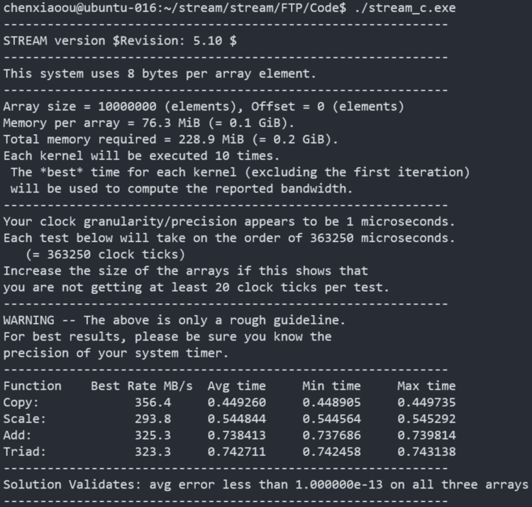
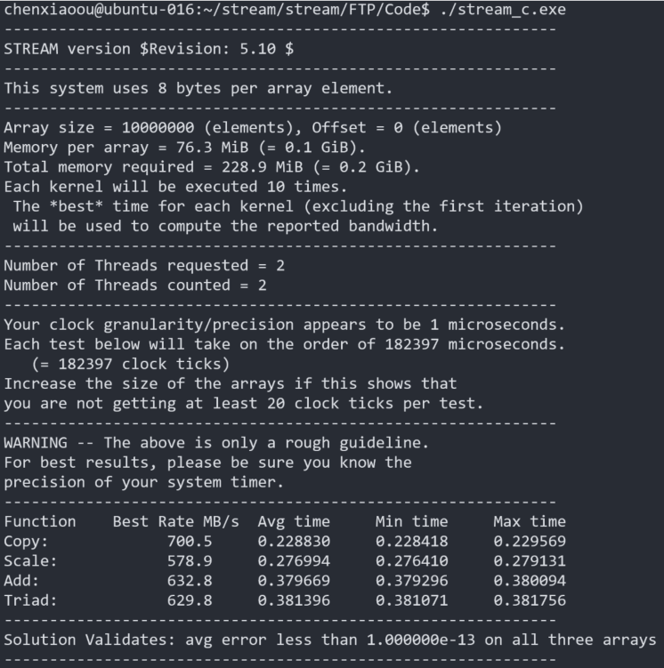
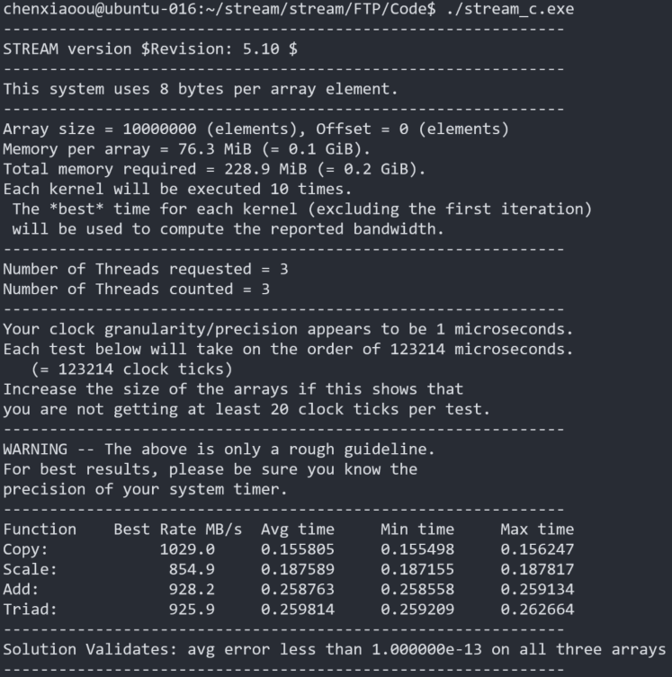
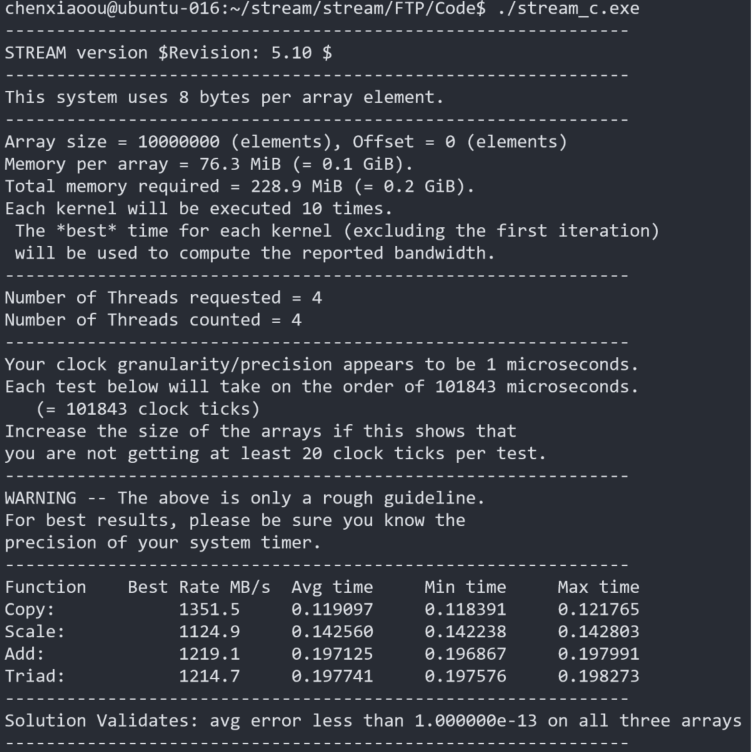
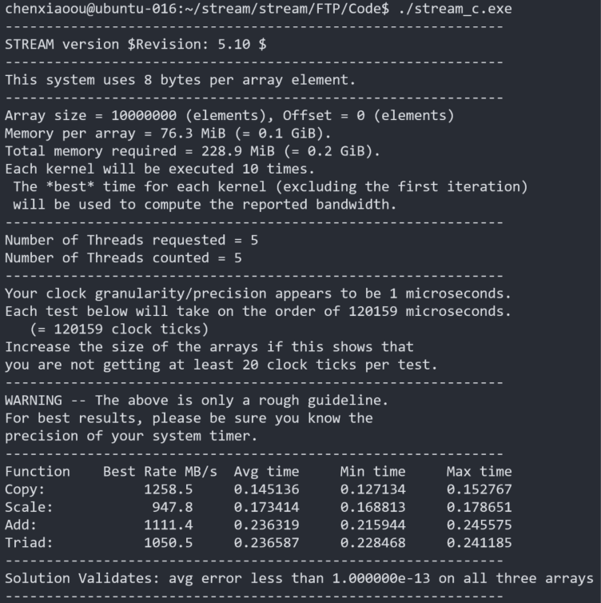
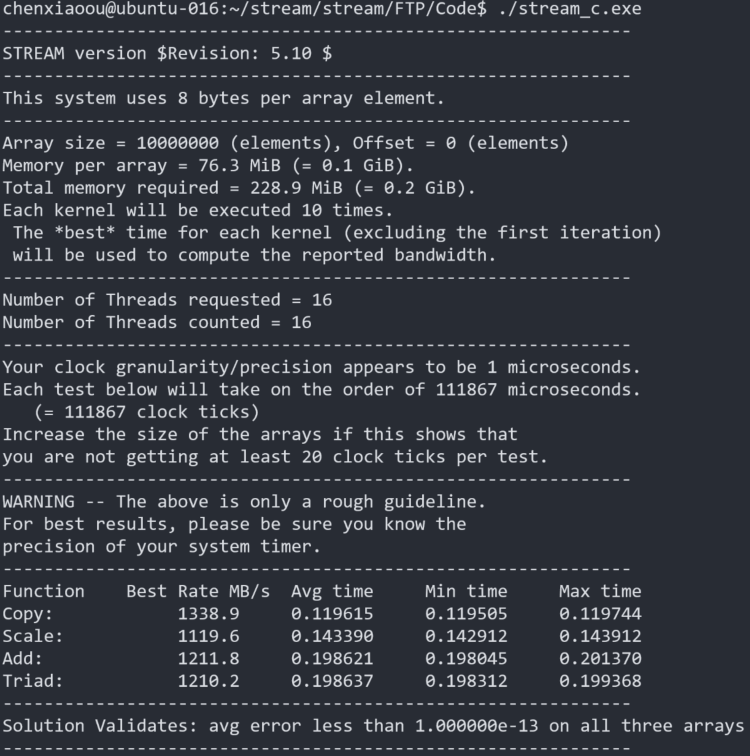

## 在Unmatched上的STREAM内存带宽测试

## STREAM是什么

一个Benchmark，用于测量持续性的内存带宽，和相应的简单向量内核的计算率。

STREAM操作的数据集要远大于cache大小，因此更能评估非常大的向量类型的应用程序的性能。

## 编译STREAM

源码地址：

http://www.cs.virginia.edu/stream/FTP/Code/

编译命令：
```
$ make all
```

运行命令：
```
./stream_c.exe
```

多线程的编译和运行:

编译选项添加`-fopenmp`，并设置环境变量`export OMP_NUM_THREADS=X`，其中X为指定的线程数，最后执行`./stream_c.exe`。

## STREAM run on Unmatched

unmatched cpu参数如下：


STREAM测试结果：

GCC -O0：


GCC -O2：



GCC -Ofast:


GCC -Ofast thread=2



GCC -Ofast thread=3



GCC -Ofast thread=4



GCC -Ofast thread=5



GCC -Ofast thread=16



## 参考：

https://www.cnblogs.com/iouwenbo/p/14377478.html

Stream带宽测试的解释 - 阳光总在风雨后的文章 - 知乎
https://zhuanlan.zhihu.com/p/407489860

