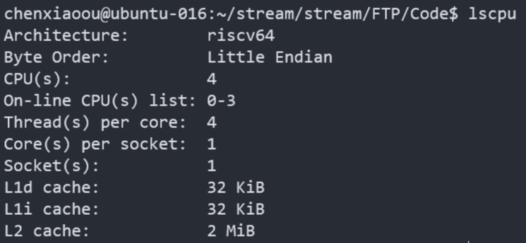

## 在Unmatched上的STREAM内存带宽测试

## STREAM是什么

一个Benchmark，用于测量持续性的内存带宽，和相应的简单向量内核的计算率。

STREAM操作的数据集要远大于cache大小，因此更能评估非常大的向量类型的应用程序的性能。

## 编译STREAM

源码地址：

http://www.cs.virginia.edu/stream/FTP/Code/

编译命令：
```
$ make all
```

运行命令：
```
./stream_c.exe
```

多线程的编译和运行:

编译选项添加`-fopenmp`，并设置环境变量`export OMP_NUM_THREADS=X`，其中X为指定的线程数，最后执行`./stream_c.exe`。

## STREAM run on Unmatched

### Overview

我们在Unmatched上测试STREAM，测试了不同编译优化级别（编译STREAM）：-O0,-O2,-Ofast；以及设置了不同的线程数：Thread=1,2,3,4,5,16。


从测试结果可以看出，编译STREAM的优化选项会对内存带宽产生影响，相对于O0，O2明显提升了带宽，而更高级的优化Ofast则并没有进一步的提升。

STREAM测试的四个项目的带宽大小关系大致是：Copy>Add>Triad>Scale。可见，不包含计算的简单读写操作能达到更大的内存带宽。

从线程数的变化可以看出，从线程数设为1到4，内存带宽基本是线性增长的，因为Unmatched具有四个核心，在这个范围内线程数的增长可以带来内存带宽的增长。当线程数设为5时，可能因为负载在多核上不均衡的缘故，内存带宽反而下降。而当线程数设为16时，基本4线程持平，不会带来更大的内存带宽。

### Results Details

unmatched cpu参数如下：



STREAM测试结果：

GCC -O0：


GCC -O2：


GCC -Ofast:


GCC -Ofast thread=2


GCC -Ofast thread=3


GCC -Ofast thread=4


GCC -Ofast thread=5


GCC -Ofast thread=16


## 参考：

1. https://www.cnblogs.com/iouwenbo/p/14377478.html

2. Stream带宽测试的解释 - 阳光总在风雨后的文章 - 知乎
https://zhuanlan.zhihu.com/p/407489860

