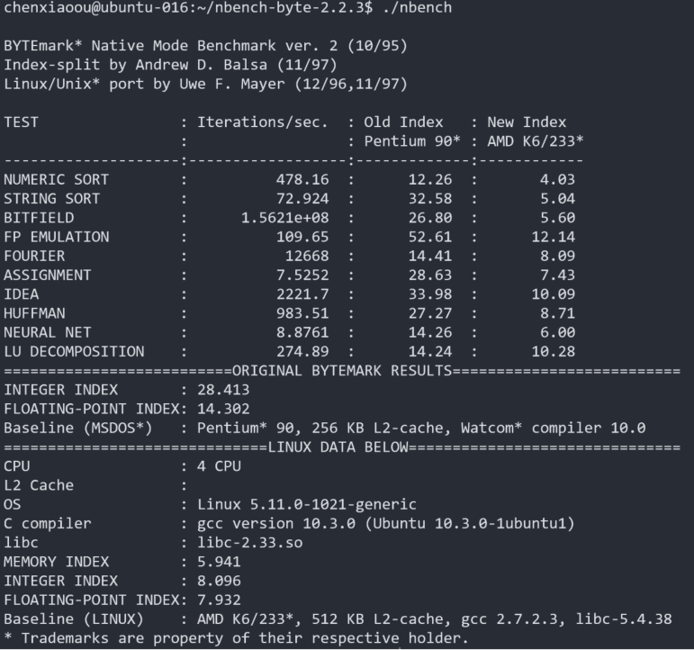
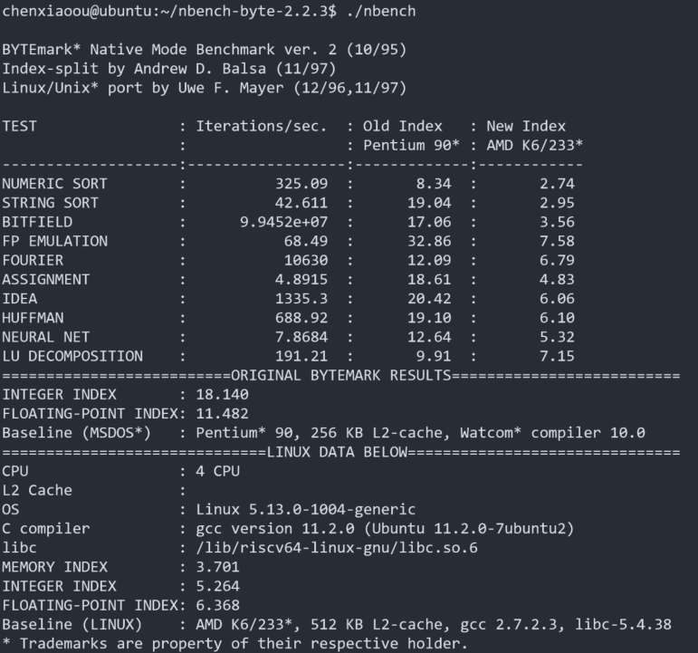

## nbench简介

nbench是一个简单的用于测试处理器、存储器性能的基准测试程序。

## ubuntu下的安装

```
$ wget http://www.math.utah.edu/~mayer/linux/nbench-byte-2.2.3.tar.gz
$ tar -xvzf nbench-byte-2.2.3.tar.gz
$ cd nbench-byte-2.2.3
$ make
$ ./nbench
```

## nbench result on Unmatched and unleashed

on unmatched:



on unleashed:


