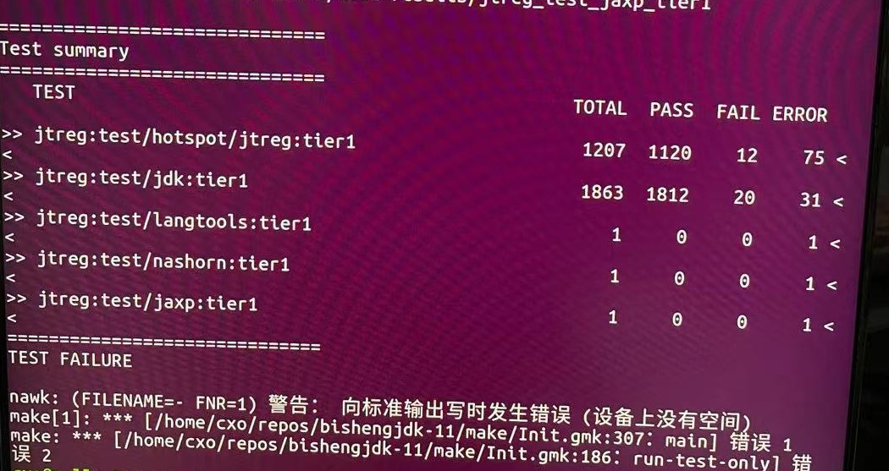

# 交叉编译bishengJDK11 for RV64 并运行回归测试

本文主要记录了在构建RV64 BishengJDK11中所遇到的问题，验证了在Unmatched上运行的情况，并且在x86构建机器上执行回归测试的方法。

## 毕昇JDK 11 for RICSV64构建

参考 [毕昇JDK 11 for RICSV64构建及HiFive Unleashed测试](https://zhuanlan.zhihu.com/p/302421409)

遇到的问题有两个：

1. 挂在Fedora的rootfs到x86主机的那一步“sudo mount /dev/loop0p4 fedora_mount”，我这里遇到找不到设备：

```
$ sudo mount /dev/loop6p4 fedora_mount
mount: /home/cxo/repos/fedora/fedora_mount: special device /dev/loop6p4 does not exist.
```

这个问题是因为我是在云服务器的docker中执行的，而docker没有被赋给mount的权限。解决方法就是切换到本地机器上执行。

2. 在步骤5.3中 make images的时候会报下面的错误：

```
fatal error: bits/types/struct___jmp_buf_tag.h: No such file or directory
40 | #include <bits/types/struct___jmp_buf_tag.h>
```

找不到struct___jmp_buftag.h这个头文件，我查了以下，在fedora_mount/usr/include下没有这个头文件，这个头文件在$RISCV-GCC/sysroot/usr/include/bits/types下，也就是riscv-gnu-toolchain的sysroot中的，但是configure中指定的sysroot是fedora_mount。

原因就是gnu toolchain的glibc版本高于fedora rootfs的glibc版本，struct___jmp_buf_tag.h 是glibc2.33里面新增的，而fedora镜像里面的glibc是2.30。解决的方法就是切换到低版本的gnu toolchain。

## 在HiFive Unmatched上验证BishengJDK运行的情况

将bishengjdk-11/build/images/jdk拷贝到unmatched上，在jdk/bin目录下执行：

```
$ ./java -version
openjdk version "11.0.11-internal" 2021-04-20
OpenJDK Runtime Environment (build 11.0.11-internal+0-adhoc.cxo.bishengjdk-11)
OpenJDK 64-Bit Server VM (build 11.0.11-internal+0-adhoc.cxo.bishengjdk-11, mixed mode)
```

unmatched系统信息：

```
$ lsb_release -a
No LSB modules are available.
Distributor ID:	Ubuntu
Description:	Ubuntu 21.04
Release:	21.04
Codename:	hirsute
```

unmatched系统中glibc的版本是2.33 ：

```
$ /lib/riscv64-linux-gnu/libc.so.6 
GNU C Library (Ubuntu GLIBC 2.33-0ubuntu5) release release version 2.33.
Copyright (C) 2021 Free Software Foundation, Inc.
This is free software; see the source for copying conditions.
There is NO warranty; not even for MERCHANTABILITY or FITNESS FOR A
PARTICULAR PURPOSE.
Compiled by GNU CC version 10.2.1 20210320.
libc ABIs: UNIQUE ABSOLUTE IFUNC
For bug reporting instructions, please see:
<https://bugs.launchpad.net/ubuntu/+source/glibc/+bugs>.
```

构建主机上gnu toolchain的glibc版本是2.29 ：

```
~/temp/riscv/sysroot/lib$ qemu-riscv64 -L /home/cxo/rvos/fedora_mount/ ./libc.so.6 
GNU C Library (GNU libc) stable release version 2.29.
Copyright (C) 2019 Free Software Foundation, Inc.
This is free software; see the source for copying conditions.
There is NO warranty; not even for MERCHANTABILITY or FITNESS FOR A
PARTICULAR PURPOSE.
Compiled by GNU CC version 10.2.0.
libc ABIs: UNIQUE ABSOLUTE
For bug reporting instructions, please see:
<http://www.gnu.org/software/libc/bugs.html>.
```

fedora镜像glibc版本是2.30:

```
~/rvos/fedora_mount/usr$ qemu-riscv64 -L /home/cxo/rvos/fedora_mount/ ./lib64/libc.so.6 
GNU C Library (GNU libc) development release version 2.30.9000.
Copyright (C) 2019 Free Software Foundation, Inc.
This is free software; see the source for copying conditions.
There is NO warranty; not even for MERCHANTABILITY or FITNESS FOR A
PARTICULAR PURPOSE.
Compiled by GNU CC version 9.2.1 20190827 (Red Hat 9.2.1-1).
libc ABIs: UNIQUE ABSOLUTE
For bug reporting instructions, please see:
<https://www.gnu.org/software/libc/bugs.html>.
```

## 在x86构建机器上执行回归测试的方法

执行回归测试之前，需要对jdk/bin目录下的二进制进行包装，使用如下的脚本prepare.sh：

```
#!/bin/sh

sysroot=/path/to/fedora_mount
QEMU=/path/to/qemu-riscv64
JAVA_HOME=/path/to/bishengjdk-11/build/images/jdk

cd $JAVA_HOME/bin
for i in `ls|grep -v "\-bak$"`
do 
    if [ -f $i ]
    then
        if [ -f ${i}-bak ]
        then 
            continue
        fi
    echo $i
        mv $i ${i}-bak
        echo "#!/bin/sh" > ${i}
        echo "export JAVA_HOME=$JAVA_HOME" >> ${i}
        echo "export LD_LIBRARY_PATH=$sysroot/usr/lib:$sysroot/lib" >> ${i}
        echo "$QEMU -L $sysroot \$JAVA_HOME/bin/${i}-bak \"\$@\"" >> ${i}
        chmod +x ${i}
    fi
done
```

这个脚本操作是把所有的二进制加上-bak后缀，然后以一个shell脚本做一个fake，shell脚本中是使用Qemu用户模式执行该二进制的命令，这样我们就不用在敲一长串的命令了。

参考：https://github.com/openjdk-riscv/jdk11u/wiki/Run-or-debug-with-QEMU-user-mode

接下来，我们来执行jdk的回归测试，需要先安装jtreg包：

```
$ sudo apt install jtreg
```

然后再执行回归测试，注意target要使用run-test-only，only意味着不会再重新生成jdk/bin下的二进制，防止覆盖我们创建的fake版本。测试命令如下：

```
$ cd YOUR-BUILD-DIR
$ make run-test-only  TEST="tier1"
```

我这里测试结果如下，因为磁盘空间耗尽（44G），测试没有完成：




