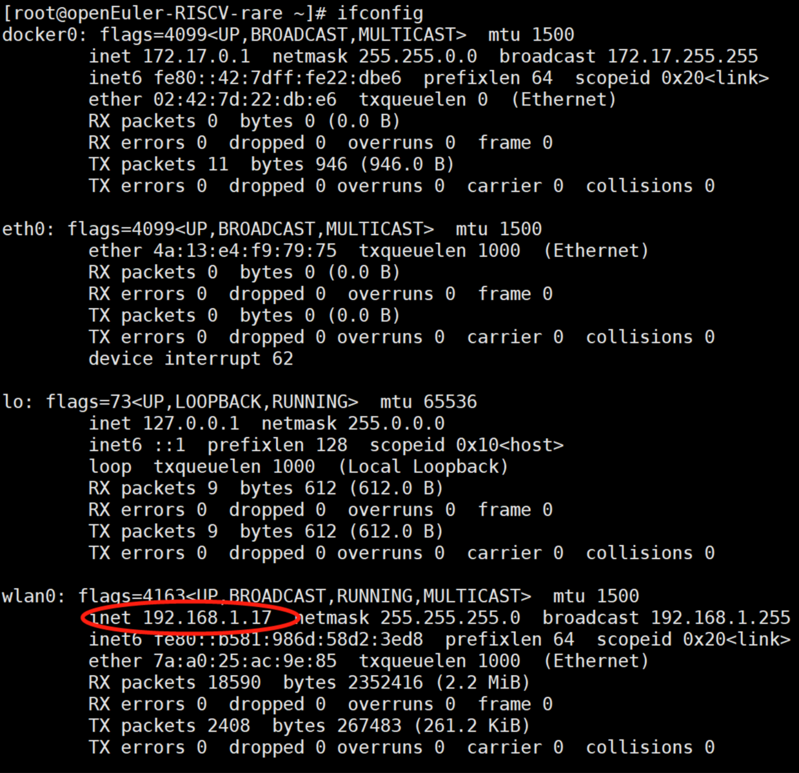

# 在D1/openEuler上安装docker，并运行docker/Debian

**实验时间**：2021.9.1

**需要的硬件有**: D1开发板，TF卡，TF卡读卡器，串口转USB线

**软件有**: Linux系统，Windows下的Xshell, Windows下的串口转USB的驱动。

**openEuler镜像**: https://mirror.iscas.ac.cn/plct/openEuler-D1-wifi-hdmi-docker-20210826.img.bz2
（这是我目前使用的版本，镜像一直在更新中）

## 步骤

### 一、在D1上安装openEuler系统

这个过程我是参考的[D1上的OpenEuler烧录安装及根目录扩容](https://zhuanlan.zhihu.com/p/397651481)

**简明步骤如下**：

#### 1. 在x86/Ubuntu下烧录oE镜像。

我的Ubuntu系统信息：

```

```

a. 将TF卡放入读卡器，连接上x86主机。

b. 下载oE镜像：

```shell
$ wget https://mirror.iscas.ac.cn/plct/openEuler-D1-wifi-hdmi-docker-20210826.img.bz2
```

c. 使用`sudo fdisk -l`通过磁盘大小可以识别出TF卡的盘符，假设是/dev/sdb。

d. 使用dd命令将镜像烧录到TF卡：

```shell
$ bzcat openEuler-D1-wifi-hdmi-docker-20210826.img.bz2 | sudo dd of=/dev/sdb bs=1M iflag=fullblock oflag=direct conv=fsync status=progress
```

e. 对/dev/sdb中的系统分区进行扩容

```shell
# 看到系统被安装在/dev/sdb4中，并且大小是1.2G。执行d->4->n->4->100832(和最开始记录的第四个分区的起始扇区相同)->default->n->w
$ sudo fdisk /dev/sdb
```

然后可以用`sudo fdisk -l`和`df -hT`查看分区和挂载的情况，可能挂载的容量还没有更新过来，需要用到下面的步骤：

```shell
$ sudo resize2fs /dev/sdb4
```

现在烧录完成，之后将TF卡放入D1并开机。

说明：这里使用的镜像应该是支持HDMI的，也就是支持显示器的信号输入的，但是我在实验过程中，显示器始终起不来。因此我这里改成用串口登录系统了，遇到同样问题的小伙伴也可以采用这种方式，以及如果使用了不支持HDMI的镜像，也可以使用串口登录。下面来看，如何使用串口登录。

#### 2. 使用串口登录uboot，并使用SSH登录oE系统

我是Windows下是用Xshell来进行串口和SSH登录的，在Linux中可以使用minicom来进行串口登录uboot。下面主要说一下Windows下的操作步骤。

a. 安装串口转USB的驱动程序

下载驱动：https://d1.docs.aw-ol.com/source/2_gettools/

需要注册账号登录下载，下载的工具和位置参见下图：


留着，待会儿安装。

现在把TF卡插入D1里，接上HDMI线到显示屏（运气好显示屏可以起来），插上串口线到x86主机的USB上，串口端插在D1的板子上，针的顺序如下，从靠近typec口依次是白绿黑线，红线不用：


这时候，打开x86主机上的设备管理器（电脑->管理->设备管理器->COM口）COM口会多出一个无法识别的硬件，右键点击它，选择安装驱动，然后指定前面下载的FT232R驱动的文件夹，然后它会自动搜索并安装。安装成功之后，会显示出USB Serial Port，如下图所示：


b. 启动D1，进入uboot界面，设置wifi

下载Xshell软件，下面是官网地址，有30天免费试用版，家庭学校用户免费版，按需下载吧。

https://www.netsarang.com/zh/xshell-download/

下载安装之后，启动Xshell，新建一个会话，协议选择SERIAL，其他默认，如下图所示：


然后连接进入这个会话，这时候串口线也是插上的，然后再给D1上电，Xshell界面就能显示出uboot的启动过程了。

（注意，一定是先插好线，开启SERIAL会话，再给D1上电）

uboot启动完成之后就可以登录系统了，登陆账号密码: root/openEuler12#$

登陆系统之后，赶紧设置WiFi吧，有wifi就能SSH登录了，不用忍受串口时不时打印出的信息。

Wifi的设置方法是：

这里使用的镜像已经支持wifi了，执行ifconfig可以看到wlan0，可以使用nmtui图形模式配置。

直接输入命令nmtui即可：


接着选择：Edit a connection -> <Add> -> Wi-Fi

填写Profile name、SSID、选择认证方式，然后就可以连接上WiFi了 : )


现在有了wifi，就可以使用SSH登录了，先查看一下D1的ip地址：



然后再Xshell中创建一个新的会话，协议选SSH，主机填入D1的IP，其他默认，确定，然后连接这个SSH会话，要求输入密码，选择保存密码。由于D1使用DHCP获得IP的，所以D1重启之后，IP就会变，那这里的IP就需要重新设置了。


到此，我们就成功登录了D1/oE，准备工作完成，下面要正式开始在D1/oE上安装Docker，并运行Docker/Linux了。


### 二、在D1/oE上安装Docker

1. 安装依赖的包

```shell
# yum install -y iptables-services
# yum install yajl-devel
```

1. 下载并安装go

目前还没有官网的go for RISCV的安装包，我们是从下面的github仓库里找到了prebuilt的安装包：

https://github.com/carlosedp/riscv-bringup/releases

这里我用的版本是go1.17.linux-riscv64.tar.gz。

```shell
# wget https://github.com/carlosedp/riscv-bringup/releases/download/v1.0/go1.17.linux-riscv64.tar.gz
# tar zxvf go1.17.linux-riscv64.tar.gz
# mv go /usr/local/
# echo 'export PATH="$PATH:/usr/local/go/bin"' >> /etc/profile
# source /etc/profile
# go version
go version go1.17 linux/riscv64
```

2. 下载docker安装包

目前还没有官网的docker for RISCV的安装包，我们是从下面的github仓库里找到了prebuilt的安装包：

https://github.com/carlosedp/riscv-bringup/releases

上面安装的oE系统的Glibc版本是2.31，适合的docker安装包是下面这个：

https://github.com/carlosedp/riscv-bringup/releases/download/v1.0/docker-19.03.8-dev_riscv64.tar.gz

如果系统的Glibc版本是2.33的话，可以使用下面这个：

https://github.com/carlosedp/riscv-bringup/releases/download/v1.0/docker-v20.10.2-dev_riscv64.tar.gz

我这里用的是docker-19.03.8-dev_riscv64.tar.gz。下载之后解压缩，并且安装包的目录，拷贝到系统的相应目录下：

```shell
# wget https://github.com/carlosedp/riscv-bringup/releases/download/v1.0/docker-19.03.8-dev_riscv64.tar.gz
# tar zxvf docker-19.03.8-dev_riscv64.tar.gz 
# mkdir docker-19.03
# tar zxvf docker-19.03.8-dev_riscv64.tar.gz -C docker-19.03
# cp docker-19.03/etc/systemd/system/* /etc/systemd/system
# cp docker-19.03/usr/local/bin/* /usr/local/bin
# cp docker-19.03/usr/local/include/* /usr/local/include
# cp -r docker-19.03/usr/local/lib/* /usr/local/lib
# cp docker-19.03/usr/local/share/man/man1/* /usr/local/share/man/man1
# cp docker-19.03/usr/local/share/man/man3/* /usr/local/share/man/man3
# cp -r docker-19.03/docker /etc/
```

3. 安装CNI的插件

```shell
# git clone https://github.com/containernetworking/plugins.git
# cd plugins/
# ./build_linux.sh
# mkdir -p /etc/cni/net.d
# cat >/etc/cni/net.d/10-mynet.conf <<EOF
{
	"cniVersion": "0.2.0",
	"name": "mynet",
	"type": "bridge",
	"bridge": "cni0",
	"isGateway": true,
	"ipMasq": true,
	"ipam": {
		"type": "host-local",
		"subnet": "10.22.0.0/16",
		"routes": [
			{ "dst": "0.0.0.0/0" }
		]
	}
}
EOF
# cat >/etc/cni/net.d/99-loopback.conf <<EOF
{
	"cniVersion": "0.2.0",
	"name": "lo",
	"type": "loopback"
}
EOF

# echo 'CNI_PATH="/root/plugins/bin"' >> /etc/profile
# source /etc/profile
```

4. 设置LD_LIBRARY_PATH

```shell
# echo 'export LD_LIBRARY_PATH="/usr/local/lib:$LD_LIBRARY_PATH"' >> /etc/profile
# source /etc/profile
# /sbin/ldconfig
```

5. 启动docker

上面的步骤都做完了之后，建议重启D1开发板，IP会改变，Xshell相应的SSH连接会话IP需要重新设置。（先用串口会话看IP，再设置SSH IP）

重启之后，查看一下后台进程，containerd和dockerd可能默认就是开启的，先把它们kill掉，例如：


总结一下命令如下：
```shell
# ps axf | grep containerd
# kill -9 354 (根据实际的containerd进程IP)
# containerd >containerd.log 2>&1 &
# systemctl start docker
```

到此，docker安装完成并且已经启动了，使用`docker version`来查看是否正常启动了：


下面就是拉取riscv64/debian的镜像，并且运行docker/debian:

```
# docker pull riscv64/debian:experimental
# docker run -it riscv64/debian:experimental /bin/bash
```

运行成功会是类似这样的：


到这里就完成了，撒花！
