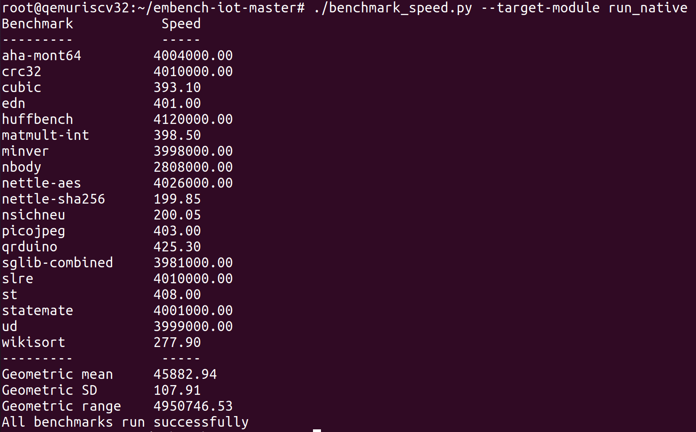

## Embench的简介，以及在RISCV32下编译和运行

### Embench简介

嵌入式、物联网系统的Benchmark。现状是还没有高质量被广泛报道的嵌入式Benchmark。嵌入式系统的特点：没有OS，最小C库支持，没有输出流。Benchmark需要适应这些特点。

属于FOSSi基金会的项目。免费开源Benchmark。脱胎于Bristol/Embecosm Embedded Benchmark Suite.

目前最新是1.0版本。

嵌入式系统Benchmark需要关注的两个Metric：性能，代码大小（memory寸土寸金）


19个真实程序组成的套件：

- aha-mont64

Montgomery乘法，是公钥算法实现中的一个核心算法，其主要作用是为模乘运算加速。

- crc32
- cubic
- edn
- huffbench
- matmult-int
- minver
- nbody
- nettle-aes
- nettle-aes
- nettle-sha256
- nsichneu
- picojpeg
- qrduino
- sglib-combined
- sire
- st
- statemate
- ud
- wikisort

运行结束将产生一个分数，用来评估平台和编译链的性能。

### 交叉编译Embench

可以选择在x86机器上进行RISCV32的交叉编译。
（ Embench现在已有对RISCV32的支持，默认还没有RISCV64支持，而rv32的程序无法在rv64板子上跑。）

1. 下载Embench

```shell
git clone https://github.com/embench/embench-iot.git
```

2. 构建或下载RISCV GNU编译工具链

- RISCV GNU编译工具链的构建参考：

https://github.com/riscv/riscv-gnu-toolchain

- 或者 下载构建好的工具链：

```shell
$ wget http://plct.zdlgv5.com/riscv32_extlib.tar.gz
$ tar -xzvf riscv32_extlib.tar.gz
# 设置环境变量
$ export PATH="$HOME/riscv32/bin:$PATH"
```

3. 运行脚本build_all.py进行编译

运行脚本build_all.py进行编译，需要安装python3和pyelftools。

```shell
$ sudo apt install python3

$ sudo ln -snf /usr/bin/python3 /usr/bin/python

$ sudo apt install python3-pip

$ pip3 install pyelftools

$ cd embench-iot

$ ./build_all.py --arch riscv32 --chip generic --board ri5cyverilator --cc $HOME/riscv32/bin/riscv32-unknown-elf-gcc --cflags="-O2 -ffunction-sections -march=rv32gc" --ldflags="-O2 -W -march=rv32gc -Lm" --cc-output-pattern="-c" --user-libs="$HOME/riscv32/riscv32-unknown-elf/lib/libm.a"
```

注意设置--cc-output-pattern，不然会报错，说找不到main函数。
另外，由于nbody, st, wikisort, cubic使用到了math库，ldflags需要加上-Lm，相应的user-libs参数指定libm.a静态库的位置。若没有指定，会报如下的链接错误：

```shell
Compilation of benchmark "nbody" successful
Warning: Link of benchmark "nbody" failed

/home/cxo/opt/rv32/lib/gcc/riscv32-unknown-elf/10.2.0/../../../../riscv32-unknown-elf/bin/ld: nbody.o: in function `.L23':
nbody.c:(.text.bodies_energy+0xe4): undefined reference to `sqrt'
collect2: error: ld returned 1 exit status

In directory "/home/cxo/repos/embench-iot-master/build/src/nbody"
Command was:
/home/cxo/opt/rv32/bin/riscv32-unknown-elf-gcc -O2 -W -march=rv32gc -o nbody nbody.o /home/cxo/repos/embench-iot-master/build/config/riscv32/chips/generic/chipsupport.o /home/cxo/repos/embench-iot-master/build/config/riscv32/boards/ri5cyverilator/boardsupport.o /home/cxo/repos/embench-iot-master/build/support/main.o /home/cxo/repos/embench-iot-master/build/support/beebsc.o
```

编译成功，将生成bd目录，rv32的可执行程序在bd/src下

### 在Qemu系统模式下运行Embench

虽然可以使用Qemu的用户模式直接运行bd/src下的rv32可执行程序，命令如下。但是要获得性能和code size的对标数据，需要运行Embench提供的benchmark_size.py和benchmaark_speed.py，这里我们是在Qemu的系统模式下运行RISCV32 Linux （yocto），并在其上运行Embench。

```
$ $HOME/riscv32/bin/qemu-riscv32 -L $HOME/riscv32/sysroot/ ./bd/src/aha-mont64/aha-mont64
```

#### 在Qemu系统模式下运行RISCV32的Linux

在Qemu系统模式下运行RISCV32 Linux的方法参考：

https://zhuanlan.zhihu.com/p/342188138

遇到的问题记录：
- bitbake: command not found

解决方法： `source  openembedded-core/oe-init-build-env`

- Your system needs to support the en_US.UTF-8 locale.

解决方法：
```shell
sudo apt install locales
sudo dpkg-reconfigure locales
```

- 运行```MACHINE=qemuriscv32 runqemu nographic```
报错
```
runqemu - ERROR - TUN control device /dev/net/tun is unavailable; you may need to enable TUN (e.g. sudo modprobe tun)
```
当执行```sudo modprobe tun```后报告
```
modprobe: FATAL: Module tun not found in directory /lib/modules/4.15.0-124-generic
```
这可能是Host的内核缺少tun模块，可能因为是在云服务器的docker中做的，换到本地机器就没有这个问题了。

#### 在Qemu系统模式下的RISCV32 linux中运行Embench

1. 开启yocto的SSH和SCP，方便拷贝Embench

参考https://zhuanlan.zhihu.com/p/342188138

2. 安装python3

在`riscv-yocto/build/conf/local.conf`中添加软件包

```shell
# file build/conf/local.conf
# （python3前面有个空格）
IMAGE_INSTALL_append = " python3"                    
```
重新构建
```
$ MACHINE=qemuriscv32 bitbake core-image-full-cmdline
```
重启虚拟机
```
MACHINE=qemuriscv32 runqemu nographic slirp
```
重启之后,`scp`将Host中编译好的Embench拷贝到yocto中。
```
scp -P 2222 ./embench-iot.tar.gz root@localhost:~/
```

3. run Embench

```
./benchmark_speed.py --target-module run_native
```



### 参考资料

1. https://github.com/embench
2. https://risc-v-getting-started-guide.readthedocs.io/en/latest/linux-qemu.html#
3. https://wiki.qemu.org/Documentation/Platforms/RISCV
4. https://qemu.readthedocs.io/en/latest/system/target-riscv.html
5. https://www.embench.org/
