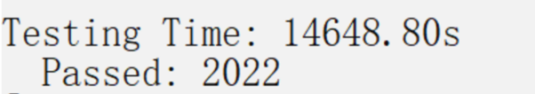

# LLVM RISCV64 native工具的构建，并在D1开发板上运行LLVM test-suite

## 前言

- 这里我们针对LLVM test-suite，里面是完全的程序，是单独的一个仓库，而不是`make check`所执行的单元测试和回归测试。


- 测试分为两种：

1. 测试交叉工具链LLVM编译出的程序是否可以在D1上实际运行；
2. riscv native LLVM是否可以成功编译程序并且程序能够正确运行。


## 测试交叉工具链LLVM编译出的程序是否可以在D1上实际运行

### 交叉编译test-suite

构建交叉编译工具链LLVM，并使用LLVM对test-suite进行面对RISCV的交叉编译，具体步骤如下：

1. 下载LLVM-project源码：
```shell
$ git clone https://github.com/llvm/llvm-project.git
```

2. 构建支持RISCV的交编译工具LLVM
```shell
$ cd llvm-projec
$ mkdir build && cd build
$ cmake -DLLVM_PARALLEL_LINK_JOBS=3 -DLLVM_TARGETS_TO_BUILD="X86;RISCV" -DLLVM_ENABLE_PROJECTS="clang" -G Ninja ../llvm
$ ninja
```

3. 下载test-suite源码
```shell
$ cd llvm-project/llvm/projects
$ git clone https://github.com/llvm/llvm-test-suite.git test-suite

```

4. 面对RISCV交叉编译test-suite
```shell
$ cd test-suite
$ mkdir test-suite-build-riscv && cd test-suite-build-riscv
```

新建一个文件 clang_riscv_linux.cmake，文件的内容如下（按照实际情况配置）：
```
set(CMAKE_SYSTEM_NAME Linux )
set(triple riscv64-unknown-linux-gnu )
set(CMAKE_C_COMPILER /home/cxo/repos/llvm-project/build/bin/clang CACHE STRING "" FORCE)
set(CMAKE_C_COMPILER_TARGET ${triple} CACHE STRING "" FORCE)
set(CMAKE_CXX_COMPILER /home/cxo/repos/llvm-project/build/bin/clang++ CACHE STRING "" FORCE)
set(CMAKE_CXX_COMPILER_TARGET ${triple} CACHE STRING "" FORCE)
set(CMAKE_SYSROOT  /home/cxo/temp/riscv/sysroot)
set(CMAKE_C_COMPILER_EXTERNAL_TOOLCHAIN /home/cxo/temp/riscv)
set(CMAKE_CXX_COMPILER_EXTERNAL_TOOLCHAIN  /home/cxo/temp/riscv)
```

继续执行cmake和make：
```shell
$ cmake -DCMAKE_TOOLCHAIN_FILE=./clang_riscv_linux.cmake -DCMAKE_C_COMPILER=$HOME/repos/llvm-project/build/bin/clang ../test-suite/
$ make
```
注意make不要使用-j，这里并行构建会有问题。

### 在Qemu/Fedora for rv64上运行test-suite

1. 启动Qemu/Fedora，运行runQemu.sh脚本，脚本的内容如下：

```shell
#! /bin/bash

# List here required TCP and UDP ports to be exposed on Qemu
TCPports=(2049 38188 8080 6443 8443 9090 9093)
UDPports=(2049 38188)

LocalSSHPort=22223

for port in ${TCPports[@]}
do
 ports=hostfwd=tcp::$port-:$port,$ports
done
for port in ${UDPports[@]}
do
 ports=hostfwd=udp::$port-:$port,$ports
done

ports=$ports"hostfwd=tcp::$LocalSSHPort-:22"

qemu-system-riscv64 \
   -nographic \
   -machine virt \
   -smp 4 \
   -m 8G \
   -kernel Fedora-Minimal-Rawhide-20200108.n.0-fw_payload-uboot-qemu-virt-smode.elf \
   -bios none \
   -object rng-random,filename=/dev/urandom,id=rng0 \
   -device virtio-rng-device,rng=rng0 \
   -device virtio-blk-device,drive=hd0 \
   -drive file=Fedora-Minimal-Rawhide-20200108.n.0-sda.raw,format=raw,id=hd0 \
   -device virtio-net-device,netdev=usernet \
   -netdev user,id=usernet,$ports
```

其中ssh的端口号是22223，下面会使用scp拷贝test-suite到虚拟机中，scp需要指定-P 22223。

2. 将test-suite的build目录打包并scp传到虚拟机中：
```shell
$ tar zcvf test-build-riscv.tar.gz test-build-riscv/
$ scp -P 22223 test-build-riscv.tar.gz riscv@localhost:/home/riscv
```

3. 在虚拟机中解压，并试着执行其中一个benchmark

```shell
$ tar zxvf test-build-riscv.tar.gz
$ cd /home/riscv/test-build-riscv/SingleSource/Benchmarks/Linpack
$ ./linpack-pc
Rolled Single Precision Linpack Benchmark - PC Version in 'C/C++'

Compiler     INSERT COMPILER NAME HERE
Optimisation INSERT OPTIMISATION OPTIONS HERE

norm resid      resid           machep         x[0]-1          x[n-1]-1
   1.6    3.80277634e-05   1.19209290e-07  -1.38282776e-05  -7.51018524e-06

Times are reported for matrices of order          100
1 pass times for array with leading dimension of  201

      dgefa      dgesl      total     Mflops       unit      ratio

Calculating matgen overhead
       100 times   0.00 seconds
       200 times   0.00 seconds
       400 times   0.00 seconds
Overhead for 1 matgen      0.00000 seconds

Calculating matgen/dgefa passes for 5 seconds
       100 times   0.00 seconds
       200 times   0.00 seconds
       400 times   0.00 seconds
Passes used          0

Times for array with leading dimension of 201

      dgefa      dgesl      total     Mflops       unit      ratio
Average                                 0.00

Calculating matgen2 overhead
Overhead for 1 matgen      0.00000 seconds

Times for array with leading dimension of 200

      dgefa      dgesl      total     Mflops       unit      ratio
Average                                 0.00
```

### 编译LLVM running on riscv64

如果需要在Fedora for rv64上完整的运行test-suite，那么就需要llvm-lit工具，这个需要自己手动编译。

那么，我们就要来看怎样交叉编译llvm到riscv64平台，参考的资料有：

https://llvm.org/docs/GettingStarted.html#cross-compiling-llvm

https://llvm.org/docs/HowToCrossCompileLLVM.html

https://clang.llvm.org/docs/CrossCompilation.html

```shell
$ cd llvm-project

$ mkdir build-riscv && cd build-riscv

# 复用前面的clang_riscv_linux.cmake文件
$ cp ../llvm/projects/test-build-riscv/clang_riscv_linux.cmake .

$ cmake -DLLVM_PARALLEL_LINK_JOBS=3 -DCMAKE_CROSSCOMPILING=True -DLLVM_TABLEGEN=$HOME/repos/llvm-project/build/bin/llvm-tblgen -DCLANG_TABLEGEN=$HOME/repos/llvm-project/build/bin/clang-tblgen -DLLVM_DEFAULT_TARGET_TRIPLE=riscv64-unknown-linux-gnu -DLLVM_TARGET_ARCH=RISCV64 -DLLVM_TARGETS_TO_BUILD=RISCV -DCMAKE_TOOLCHAIN_FILE=./clang_riscv_linux.cmake ../llvm/

$ make -j 52
```

编译完之后发现llvm-lit工具不是一个elf文件，而是一个python文件。

将llvm-lit拷贝到qemu/fedora下面，执行./llvm-lit，会有如下报错：


按照官网文档的如下步骤安装llvm-lit：
```shell
$ mkdir venv
$ virtualenv venv
$ . venv/bin/activate
$ pip install svn+https://llvm.org/svn/llvm-project/llvm/trunk/utils/lit
$ lit --version
lit 0.8.0dev
```
在pip install步骤报错如下：


llvm-project/llvm/utils/lit是lit的源代码，这里有setup.py，下面把该目录拷贝到Qemu/Fedora上，然后执行setup.py:

```shell
$  scp -P 22223 -r lit/ riscv@localhost:/home/riscv
```

in Qemu/Fedora :

```shell
$ cd lit
$ sudo python setup.py install
$ lit --version
lit
14.0.0dev
```
test-suite test-build-riscv

需要该test-build-riscv/lit.site.cfg

```
import sys

config.test_source_root = "/home/cxo/repos/llvm-project/llvm/projects/test-build-riscv"
config.test_exec_root = "/home/cxo/repos/llvm-project/llvm/projects/test-build-riscv"
config.remote_client = "ssh"
config.remote_host = ""
config.run_under = ""
config.user_mode_emulation = False
config.strip_tool = "/usr/bin/strip"
config.profile_generate = False
config.llvm_profdata = ""
config.llvm_size = "/home/cxo/repos/llvm-project/build/bin/llvm-size"
config.test_modules = "run;codesize;hash;compiletime;timeit".split(';')

lit_config.load_config(config, "/home/cxo/repos/llvm-project/llvm/projects/test--
suite/lit.cfg")
```

需要按照原本x86构建机器上的目录结构，在Qemu/fedora上创建一样的目录，那也就需要和x86机器上同样的用户名。
```
# 新建下面的目录，并把x86机器上的test-suite和test-build-riscv拷贝到下面的目录中
$ mkdir /home/cxo/repos/llvm-project/llvm/projects/
```

strip换成Qemu/fedora系统自己的：
```
config.strip_tool = "/usr/bin/strip"
```
Qemu/fedora上新建目录，将x86下编译好的llvm-size拷贝到Qemu/fedora中
```
$ mkdir /home/cxo/repos/llvm-project/build/bin/
```

另外，还需要把在x86构建机器上交叉编译时指定的sysroot文件夹拷到Qemu/fedora上，并且放在相同的路径下

执行整个test-suite：
```shell
$ cd test-build-riscv
$ lit -v -j 1 -o results.json .
```
结果如下：(共有2022个测试程序，全部通过)



但是llvm-size没有找到，应该没有计算出测试程序的大小：


