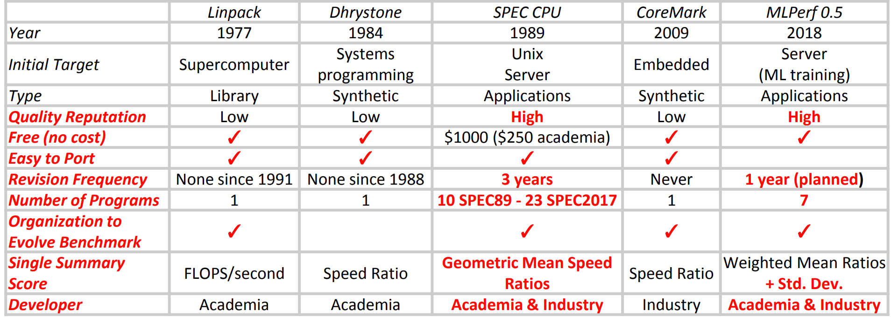
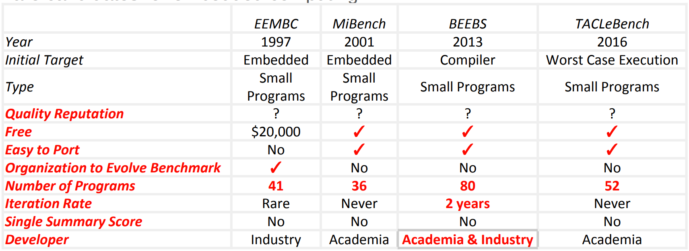

## Run three benchmark: Dhrystone, fpmark, audiocodec

### 1. Dhrystone

#### - benchmark下载

1. Dhystone2.1
http://groups.google.com/group/comp.arch/browse_thread/thread/b285e89dfc1881d3/068aac05d4042d54?lnk=gst&q=dhrystone+2.1#068aac05d4042d54
```
This is a shell archive, meaning:
1) Remove everything above the #! /bin/sh line.
2) Save the resulting text in a file.
3) Execute the file with /bin/sh (not csh) to create:
Rationale
dhry.h
dhry_1.c
dhry_2.c
```
2. riscv-tests benchmark

https://github.com/riscv/riscv-tests

#### - 编译和运行

###### 1. source1中的dhystone2.1的编译：

参考https://riscv.org/blog/2014/10/about-our-dhrystone-benchmarking-methodology/的编译命令：

```
$ riscv64-unknown-elf-gcc -c -O2 -fno-inline dhry_1.c
$ riscv64-unknown-elf-gcc -c -O2 -fno-inline dhry_2.c
$ riscv64-unknown-elf-gcc -o dhrystone dhry_1.o dhry_2.o
```

会有下面报错：

```
dhry_1.c:32:14: error: conflicting types for 'malloc'
   32 | extern char *malloc ();
      |              ^~~~~~
In file included from dhry_1.c:19:
/home/molly/opt/rv64/riscv64-unknown-elf/include/stdlib.h:108:7: note: previous declaration of 'malloc' was here
  108 | void *malloc(size_t) __malloc_like __result_use_check __alloc_size(1) _NOTHROW;
      |       ^~~~~~
dhry_1.c:49:12: error: conflicting types for 'times'
   49 | extern int times ();
      |            ^~~~~
In file included from dhry.h:371,
                 from dhry_1.c:18:
/home/molly/opt/rv64/riscv64-unknown-elf/include/sys/times.h:24:9: note: previous declaration of 'times' was here
   24 | clock_t times (struct tms *);
      |         ^~~~~

dhry_1.c:51:27: error: 'HZ' undeclared (first use in this function)
   51 | #define Too_Small_Time (2*HZ)
```

###### 2. source2中的riscv-tests的编译

**编译**

```
$ git clone https://github.com/riscv/riscv-tests
$ cd riscv-tests
$ git submodule update --init --recursive
$ autoconf
$ ./configure --prefix=$RISCV/target
$ make
$ make install
```

或者是单独编译dhystone，命令如下：
```
$ riscv64-unknown-elf-gcc -I./../env -I./common -I./dhrystone -DPREALLOCATE=1 -mcmodel=medany -static -std=gnu99 -O2 -ffast-math -fno-common -fno-builtin-printf -o dhrystone.elf ./dhrystone/dhrystone.c ./dhrystone/dhrystone_main.c ./common/syscalls.c ./common/crt.S -static -nostdlib -nostartfiles -lm -lgcc -T ./common/test.ld
```
**运行**

- qemu用户模式运行

```
molly@molly-Huawei:~/repos/riscv-tests/benchmarks$ qemu-riscv64 ./dhrystone.riscv
非法指令 (核心已转储)
```

- qemu系统模式的fedora下也不能运行
- spike运行

用`spike pk ./dhrystone.riscv`会报告非法指令
```
molly@molly-Huawei:~/repos/riscv-tests/benchmarks$ spike /home/molly/opt/rv64/riscv64-unknown-elf/bin/pk dhrystone.riscv
bbl loader
z  0000000000000000 ra 0000000000000000 sp 0000000000000000 gp 0000000000000000
tp 0000000000000000 t0 000000000001e000 t1 0000000000000000 t2 0000000000000000
s0 0000000000000000 s1 0000000000000000 a0 0000000000000000 a1 0000000000000000
a2 0000000000000000 a3 0000000000000000 a4 0000000000000000 a5 0000000000000000
a6 0000000000000000 a7 0000000000000000 s2 0000000000000000 s3 0000000000000000
s4 0000000000000000 s5 0000000000000000 s6 0000000000000000 s7 0000000000000000
s8 0000000000000000 s9 0000000000000000 sA 0000000000000000 sB 0000000000000000
t3 0000000000000000 t4 0000000000000000 t5 0000000000000000 t6 0000000000000000
pc 0000000080000040 va/inst 000000003002a073 sr 8000000200006020
An illegal instruction was executed!
```

最后用`spike ./dhrystone.riscv`可以运行

```
molly@molly-Huawei:~/repos/riscv-tests/benchmarks$ spike dhrystone.riscv
Microseconds for one run through Dhrystone: 392
Dhrystones per Second:                      2550
mcycle = 196024
minstret = 196029
```

*gh/issue中有人提到riscv-tests的编译仅适合bare metal系统，所以在OS host系统中运行不了。*


#### - Reference
1. https://en.wikipedia.org/wiki/Dhrystone
2. https://developer.arm.com/documentation/dai0273/latest/
3. https://github.com/riscv/riscv-tests
4. https://github.com/openhwgroup/cva6/issues/405
3. https://github.com/riscv/riscv-tests/issues/305
4. https://riscv.org/blog/2014/10/about-our-dhrystone-benchmarking-methodology/


### 2. FPmark

#### - FPmark简介

官网：https://www.eembc.org/fpmark/

*不是免费的，需要收费*

FPMark是嵌入式行业的第一个浮点基准测试软件套件。浮点算法对于嵌入式应用至关重要，例如音频，视频，DSP，图形，汽车和电机控制。与CoreMark®旨在成为“更好的Dhrystone”的方式相同，FPMark提供的东西比“有些古怪”的Whetstone和Linpack更好。

虽然已经有几种通用的FP基准测试（即Linpack，Nbench，Livermore循环），但并未努力标准化版本或运行测试的方法。 FPMark解决了这两个问题。

FPMark由配置为工作负载的许多内核组成。工作负载因浮点精度而异：单精度（SP）和双精度（DP）；单精度（SP）和双精度（DP）。以及数据集大小（小，中，大）。这些排列反映了广泛的微控制器和平台。

FPMark支持多核。它建立在EEMBC多实例测试工具（MITH）的基础上，该工具可以对多个上下文或工作程序进行运行时配置，以检查平台的并行性能。内核分为不同的标记，有助于总结性能。 MITH框架几乎不需要FP库支持，并且与POSIX线程兼容（如果不支持线程库，则还有单线程版本）。支持RToS，baremetal和Linux。

所有工作负载都是自我验证的，这意味着将预期结果与IEEE 64位精度生成的“黄金标准”进行了比较。 

#### - 算法

这是FPMark中使用的算法的列表（以及源代码中使用的内核名称）。每种算法都以**三种不同的数据集**大小以及**单精度和双精度**运行。

    ArcTan（atan）：通过使用三角形两侧的比率来计算直角三角形之间的夹角，从而计算直角三角形的夹角。
    Black-Scholes（黑人）：包含衍生工具的金融市场动态数学模型。
    霍纳法（horner）：一种近似多项式根的方法。有关更多信息，请参见Wikipedia。
    快速傅立叶变换（radix2）：具有任何功能并将其转换为等效的正弦波集；音频，频谱分析和图像压缩（以基数2计算）等应用程序。
    线性代数（linear_alg）：衍生自Linpack；例如，对于了解结构工程中的平衡力，在相对坐标系之间进行转换，求解微分方程以及了解旋转和流体流动等方面非常有用。
    增强的Livermore循环（循环，内部产品）：这个内核包含从劳伦斯·利弗莫尔实验室使用的程序中提取的十二个实际功能。它们用于测试并行硬件的计算能力，并覆盖2D单元内粒子，三对角线消除和普朗克分布等区域。
    LU分解（lu）：执行上下矩阵分解。
    神经网络（nnet）：小型神经网络推理引擎。
    射线追踪器（ray-Tracer（ray））：一种通过跟踪穿过图像平面中像素的光路并模拟其与虚拟对象相遇的效果来生成图像的技术。
    傅里叶系数（xp1px）：数值分析程序，用于计算序列或通过在间隔[0 + epsilon，2-epsilon]上定义的复指数的离散总和（也称为（x + 1）^ x）表示周期函数。
    
### 3. linpack

对于浮点性能评估，目前很少使用whetstone，更可能使用LINPACK。 LINPACK涉及使用浮点数对矩阵进行LU分解。结果以MFLOPS表示。

因为目前缺少RISCV上的基础的线性代数子程序，LINPACK还无法在RISCV平台上运行。

#### - Reference

1. http://www.ieee-hpec.org/2018/2018program/index_htm_files/150.pdf
2. https://riscv.org/blog/2020/11/understanding-the-performance-of-processor-ip-cores/

### 4. whetstone

浮点性能测试程序

目前有适配了hifive riscv board的版本：
https://github.com/riktw/whetstone_hifive


### 5.coremark

EEMBC的CoreMark®是另一种流行的嵌入式应用综合基准，其目的是进行代表嵌入式整数处理需求的操作。这些包括列表处理，矩阵运算，有限状态机和CRC。

Coremark for riscv:
https://github.com/riscv-boom/riscv-coremark

```
$ git clone https://github.com/riscv-boom/riscv-coremark.git
$ git submodule update --init

## $RISCV point to your RISCV tools
$ export RISCV="/home/molly/opt/rv64"

## build benchmark
$ ./build-coremark.sh

## run benchmark using spike pk
$ spike /home/molly/opt/rv64/riscv64-unknown-elf/bin/pk coremark.riscv
```

在spike pk下运行的结果：
```
bbl loader
2K performance run parameters for coremark.
CoreMark Size    : 666
Total ticks      : 14146253904
Total time (secs): 14.146254
Iterations/Sec   : 2827.603708
Iterations       : 40000
Compiler version : GCC10.2.0
Compiler flags   : -O2   
Memory location  : Please put data memory location here
                        (e.g. code in flash, data on heap etc)
seedcrc          : 0xe9f5
[0]crclist       : 0xe714
[0]crcmatrix     : 0x1fd7
[0]crcstate      : 0x8e3a
[0]crcfinal      : 0x25b5
Correct operation validated. See README.md for run and reporting rules.
CoreMark 1.0 : 2827.603708 / GCC10.2.0 -O2    / Heap
```

### 6. 常用benchmark的比较和发展




